<!--
  ============================================================================
   ZelEn Quantum Encryption — README
   Beautified layout with unified mermaid palette, hero banner, and
   GitHub-native callouts. Hero SVGs are committed at repo root and referenced
   via a <picture> element for theme-aware rendering.
  ============================================================================
-->

<div align="center">

<a href="https://zelen.rocheston.com">
  <picture>
    <source media="(prefers-color-scheme: dark)" srcset="./hero-dark.svg">
    <source media="(prefers-color-scheme: light)" srcset="./hero-light.svg">
    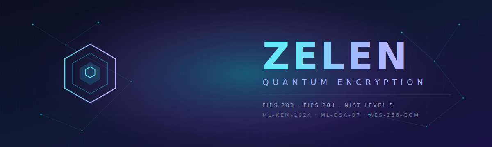
  </picture>
</a>

# ⬡ &nbsp;ZelEn Quantum Encryption

### The world's first full-stack post-quantum encryption platform &nbsp;·&nbsp; built on NIST FIPS 203 & 204

<br/>

<!-- ─── Standards row ─────────────────────────────────────────────────────── -->
[](https://doi.org/10.6028/NIST.FIPS.203)
[](https://doi.org/10.6028/NIST.FIPS.204)
[](https://csrc.nist.gov/publications/detail/sp/800-38d/final)
[](https://github.com/P-H-C/phc-winner-argon2)
[](https://openquantumsafe.org)

<!-- ─── Build & release row ───────────────────────────────────────────────── -->
[](https://github.com/rocheston/zelen/releases/tag/v1.2.0)
[](https://github.com/rocheston/zelen/actions/workflows/zelen-full-lifecycle.yml)
[](https://hub.docker.com/r/rocheston/zelen)
[](LICENSE)

<br/>

> *“Harvest now, decrypt later. The adversary is already recording your traffic.*  
> *The question is not whether to upgrade — it is whether you already have.”*

<br/>

[**🔐 &nbsp; Live Playground**][zelen-site] &nbsp;·&nbsp;
[**📄 &nbsp; Whitepaper**](https://zelen.rocheston.com/ZelEn_Whitepaper.pdf) &nbsp;·&nbsp;
[**📦 &nbsp; Releases**](https://github.com/rocheston/zelen/releases) &nbsp;·&nbsp;
[**🐳 &nbsp; Docker Hub**](https://hub.docker.com/r/rocheston/zelen) &nbsp;·&nbsp;
[**🏢 &nbsp; Zelfire**](https://zelfire.com)

</div>

---

## ⬇️ &nbsp; Download ZelEn v1.2.0

<div align="center">

| Platform | Binary | Size |
|:--|:--|:--:|
| 🍎 &nbsp; macOS Apple Silicon (ARM64) | [**zelen-1.2.0-macos-arm64.zip**](https://github.com/rocheston/zelen/releases/download/v1.2.0/zelen-1.2.0-macos-arm64.zip) | ~2 MB |
| 🐧 &nbsp; Linux Intel/AMD (x86_64)    | [**zelen-1.2.0-linux-x86_64.zip**](https://github.com/rocheston/zelen/releases/download/v1.2.0/zelen-1.2.0-linux-x86_64.zip) | ~3 MB |
| 🐳 &nbsp; Docker (linux/amd64)        | `docker pull rocheston/zelen:latest` | — |

</div>

<p align="center">
  
</p>

---

## ✨ &nbsp; What's Inside

<div align="center">

<table>
<tr>
<td align="center" width="16%"><h3>🔐</h3><b>ML-KEM-1024</b><br/><sub>Key Encapsulation<br/>FIPS 203 · NIST Level 5</sub></td>
<td align="center" width="16%"><h3>✍️</h3><b>ML-DSA-87</b><br/><sub>Digital Signatures<br/>FIPS 204 · NIST Level 5</sub></td>
<td align="center" width="16%"><h3>🔒</h3><b>AES-256-GCM</b><br/><sub>Authenticated Encryption<br/>SP 800-38D · 256-bit</sub></td>
<td align="center" width="16%"><h3>🧂</h3><b>Argon2id</b><br/><sub>Passphrase KDF<br/>PHC Winner · 64 MB RAM</sub></td>
<td align="center" width="16%"><h3>⭐</h3><b>ZELC @ 0x7D</b><br/><sub>Forensic Anchor<br/>DLP · SIEM · IDS ready</sub></td>
<td align="center" width="16%"><h3>🕳️</h3><b>Fail-Closed</b><br/><sub>Generic errors only<br/>Zero oracle leakage</sub></td>
</tr>
</table>

<table>
<tr>
<td align="center" width="20%"><h3>📁</h3><b>.zelen</b><br/><sub>Encrypted container<br/>Binary or ASCII armored</sub></td>
<td align="center" width="20%"><h3>🔑</h3><b>.zkey</b><br/><sub>Private key bundle<br/>Argon2id wrapped</sub></td>
<td align="center" width="20%"><h3>📬</h3><b>.zpub</b><br/><sub>Public key bundle<br/>Share freely</sub></td>
<td align="center" width="20%"><h3>📜</h3><b>.zcert</b><br/><sub>Quantum-safe certificate<br/>ML-DSA identity binding</sub></td>
<td align="center" width="20%"><h3>🖊️</h3><b>.sig</b><br/><sub>Detached signature<br/>ML-DSA-87 · 4627 bytes</sub></td>
</tr>
</table>

</div>

<p align="center">
  
</p>

---

<details>
<summary><b>📚 &nbsp; Table of Contents</b> &nbsp; <sub>(click to expand)</sub></summary>

- [Why We Built ZelEn](#-why-we-built-zelen)
- [The Truth Nobody Wants to Say Out Loud](#%EF%B8%8F-the-truth-nobody-wants-to-say-out-loud)
- [What's Already Out There](#-lets-be-honest-about-whats-already-out-there)
- [The Philosophy That Drove Us](#-the-philosophy-that-drove-us)
- [The Five Worst Deployment Nightmares](#-the-five-worst-deployment-nightmares--and-how-zelen-kills-each-one)
- [The Optional Paranoia Layers](#-the-optional-paranoia-layers)
- [The Vertical Integration](#%EF%B8%8F-the-vertical-integration)
- [The Formal Security Guarantee](#-the-formal-security-guarantee)
- [The Bottom Line](#-the-bottom-line)
- [The Quantum Threat Timeline](#-the-quantum-threat-timeline)
- [Classical vs. Quantum Security](#%EF%B8%8F-classical-vs-quantum-security)
- [Key & Ciphertext Size Comparison](#-key--ciphertext-size-comparison)
- [ZelEn Cryptographic Stack](#-zelen-cryptographic-stack)
- [Decryption Pipeline — Fail-Closed](#-decryption-pipeline--fail-closed)
- [Alice → Bob: End-to-End Sequence](#-alice--bob-end-to-end-sequence)
- [Algorithm Suite Breakdown](#-algorithm-suite-breakdown)
- [The Quantum Threat Model](#-the-quantum-threat-model)
- [The .zelen Binary Container — Byte Map](#-the-zelen-binary-container--byte-map)
- [CLI Usage](#-cli-usage)
- [Docker](#-docker)
- [GitHub Actions CI](#%EF%B8%8F-github-actions-ci)
- [Mathematical Foundations](#%EF%B8%8F-mathematical-foundations)
- [Algorithm Suite Registry](#-algorithm-suite-registry)
- [ZelEn in the ZelC Compiler](#-zelen-encryption-in-the-zelc-compiler)
- [Performance](#-performance)
- [Security Architecture](#-security-architecture)
- [Quick Start](#-quick-start)
- [Further Reading](#-further-reading)
- [Security Disclosure](#%EF%B8%8F-security-disclosure)
- [License](#-license)

</details>

---

## 💛 &nbsp; Why We Built ZelEn

> [!NOTE]
> **A letter to every CISO, architect, and engineer who actually cares about quantum-safe encryption.**  
> &nbsp;— *by Haja Mo*

> ☕ &nbsp; *Pull up a chair. Pour yourself a coffee. We need to have a real conversation.*
>
> If you are a CISO, a security architect, a cryptographer, or just an engineer who lies awake at night wondering whether your encryption will survive the next five years — **this letter is for you.** We are going to talk about cryptography the way it actually is. Not the marketing version. Not the conference-keynote version. The **REAL** version.

---

## ⚠️ &nbsp; The Truth Nobody Wants to Say Out Loud

<div align="center">

### `MATH DOESN'T GET HACKED.  IMPLEMENTATIONS DO.`

</div>

Let me say that one more time so it sinks in. **The math is almost never the problem.**

RSA was not broken by some genius factoring 2048-bit primes in his garage. It was broken by **Heartbleed**. By **padding oracle attacks**. By **Bleichenbacher attacks**. By developers **reusing nonces**. By bad random number generators. By libraries that leaked timing information.

The algorithms were strong. **The IMPLEMENTATIONS were weak.**

And NIST has now handed the world the ultimate post-quantum cryptographic engines:

> [!IMPORTANT]
> | Standard | Purpose | Levels |
> |---|---|---|
> | **ML-KEM** &nbsp; · &nbsp; FIPS 203 | Key Encapsulation | NIST Level 3 & 5 |
> | **ML-DSA** &nbsp; · &nbsp; FIPS 204 | Digital Signatures | NIST Level 3 & 5 |
> | **SLH-DSA** &nbsp; · &nbsp; FIPS 205 | Hash-Based Signatures | NIST Level 3 & 5 |
>
> The math is **spectacular**. Peer-reviewed. Battle-tested. Quantum-resistant. A decade of global cryptanalysis.

> [!CAUTION]
> **But here is what keeps us up at night.**
>
> If you hand developers raw post-quantum math and say *"go forth and encrypt"* — they are going to make a mistake. **Every. Single. Time.**
>
> | Mistake | Consequence |
> |---|---|
> | Reuse an AES-GCM nonce | 💀 &nbsp; Catastrophic |
> | Botch the Key Derivation Function | 💀 &nbsp; Catastrophic |
> | Fail to authenticate metadata | 💀 &nbsp; Catastrophic |
> | Reuse key material `enc` + `sign` | 💀 &nbsp; Catastrophic |
> | Leak timing via error messages | 💀 &nbsp; Catastrophic |
> | Invent ad-hoc formats with no integrity anchor | 💀 &nbsp; Catastrophic |

We have seen it. You have seen it. The post-mortems write themselves. ⚰️

<p align="center">
  
</p>

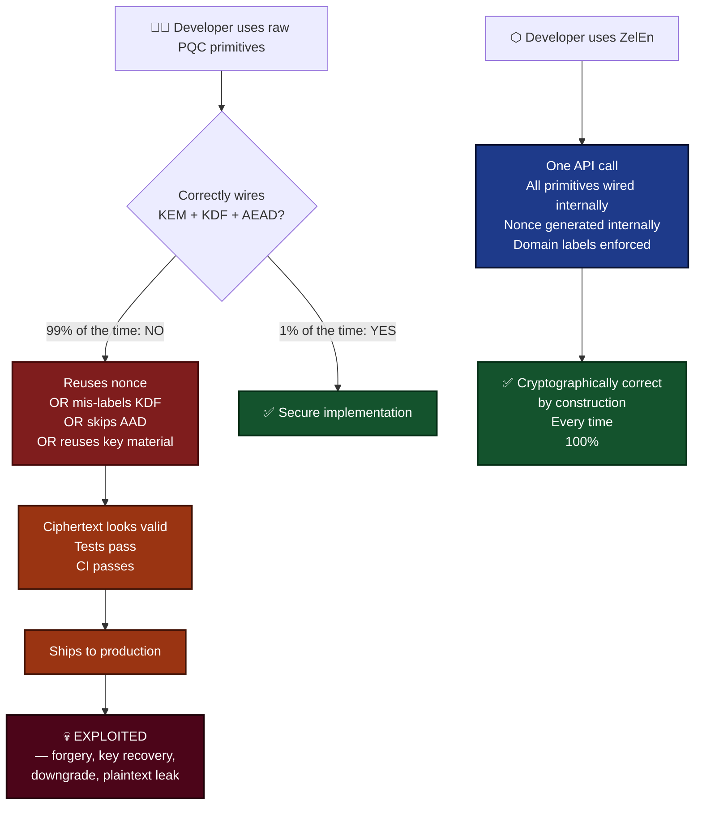
```mermaid
flowchart TD
    Dev["👨‍💻 Developer uses raw PQC primitives"] --> Q1{"Correctly wires<br/>KEM + KDF + AEAD?"}
    Q1 -- "99% of the time: NO" --> M1["Reuses nonce<br/>OR mis-labels KDF<br/>OR skips AAD<br/>OR reuses key material"]
    Q1 -- "1% of the time: YES" --> OK["✅ Secure implementation"]
    M1 --> M2["Ciphertext looks valid<br/>Tests pass<br/>CI passes"]
    M2 --> M3["Ships to production"]
    M3 --> EXPLOIT["💀 EXPLOITED<br/>— forgery, key recovery,<br/>downgrade, plaintext leak"]

    DEV2["⬡ Developer uses ZelEn"] --> AUTO["One API call<br/>All primitives wired internally<br/>Nonce generated internally<br/>Domain labels enforced"]
    AUTO --> SAFE["✅ Cryptographically correct<br/>by construction<br/>Every time<br/>100%"]

    classDef danger fill:#7f1d1d,color:#fff,stroke:#450a0a,stroke-width:2px
    classDef warn   fill:#9a3412,color:#fff,stroke:#431407,stroke-width:2px
    classDef fatal  fill:#4c0519,color:#fff,stroke:#1f0309,stroke-width:2px
    classDef safe   fill:#14532d,color:#fff,stroke:#052e16,stroke-width:2px
    classDef info   fill:#1e3a8a,color:#fff,stroke:#0a1230,stroke-width:2px
    class M1 danger
    class M2 warn
    class M3 warn
    class EXPLOIT fatal
    class OK,SAFE safe
    class AUTO info
```

---

## 🔍 &nbsp; Let's Be Honest About What's Already Out There

> *With respect — because all of these tools are brilliant in their own right.*

| Tool | What It Does Well | What It Leaves Unsolved |
|---|---|---|
| 🟢 &nbsp; **Google Tink / Libsodium** | World-class primitives | Serialization, identity binding, file formats, PKI — entirely up to you. You still wire primitives by hand. That is where mistakes happen. |
| 🦕 &nbsp; **PGP** | State-of-the-art in 1991 | Severe metadata malleability. Extreme complexity. Classical math. Quantum computers will chew it up. This is not 1991. |
| 📱 &nbsp; **Signal / Apple PQ3** | Pinnacle of real-time messaging | Not designed to encrypt a 50 GB database backup, attach compliance policy, sign it with an identity cert, and store it for seven years. |

So we asked ourselves: **WHO IS SOLVING THE WHOLE PUZZLE FOR POST-QUANTUM ENTERPRISE OBJECT SECURITY?**

> [!TIP]
> Honest answer? &nbsp; **N O B O D Y.** &nbsp; Until now.

---

## 💎 &nbsp; The Philosophy That Drove Us

<div align="center">

> ### NIST builds the cryptographic engines.<br/>ZelEn builds the **armored vehicle** around them.

</div>

That is the entire philosophy in one sentence. **Read it again. Tape it to your monitor.**

We did NOT invent new cryptographic math. We are not arrogant enough to think we can out-design lattices that have survived a decade of global peer review. We took the math that NIST and the world's best cryptographers have already vetted — and we built the **definitive, governed, misuse-resistant object-security architecture** around it.

<p align="center">
  
</p>

This was not a weekend project. This was **months** of grinding. ⚙️

Months of designing. Months of tearing architectures apart and rebuilding them. Arguing about KDF labels at 2am. Stress-testing failure modes. Reading FIPS specifications until our eyes bled. Drawing byte maps on whiteboards. Erasing them. Drawing them again.

> *“Cryptography is brutally unforgiving. We treated it that way.”*

---

## 💀 &nbsp; The Five Worst Deployment Nightmares — And How ZelEn Kills Each One

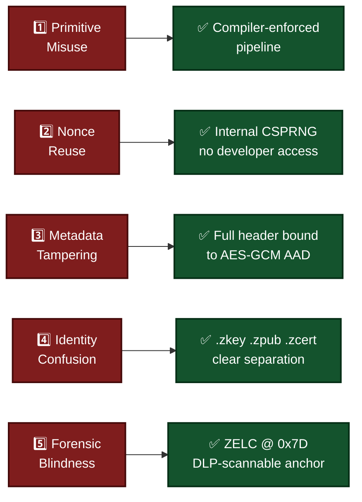
```mermaid
graph LR
    N1["1️⃣ Primitive<br/>Misuse"] --> S1["✅ Compiler-enforced<br/>pipeline"]
    N2["2️⃣ Nonce<br/>Reuse"] --> S2["✅ Internal CSPRNG<br/>no developer access"]
    N3["3️⃣ Metadata<br/>Tampering"] --> S3["✅ Full header bound<br/>to AES-GCM AAD"]
    N4["4️⃣ Identity<br/>Confusion"] --> S4["✅ .zkey .zpub .zcert<br/>clear separation"]
    N5["5️⃣ Forensic<br/>Blindness"] --> S5["✅ ZELC @ 0x7D<br/>DLP-scannable anchor"]

    classDef danger fill:#7f1d1d,color:#fff,stroke:#450a0a,stroke-width:2px
    classDef safe   fill:#14532d,color:#fff,stroke:#052e16,stroke-width:2px
    class N1,N2,N3,N4,N5 danger
    class S1,S2,S3,S4,S5 safe
```

---

### 1️⃣ &nbsp; Nightmare: Primitive Misuse — Wiring Algorithms By Hand

> *When you hand a developer ML-KEM, AES-GCM, and HKDF and say "wire these together" — the math survives. The composition fails.*

**How ZelEn kills it:** &nbsp; One path. No shortcuts. No alternative wirings.

```text
  Step 1 ─── ML-KEM-1024 ────────  Encapsulate shared secret K
               │
  Step 2 ─── HKDF-SHA-256 ───────  Domain-separated key schedule
               │
               ├── k_enc  ("payload encryption")    → AES-256-GCM
               ├── k_hdr  ("header authentication") → HMAC/tag
               └── k_sig  ("signature transcript")  → ML-DSA binding
               │
  Step 3 ─── AES-256-GCM ────────  Encrypt payload with k_enc
               │
  Step 4 ─── ML-DSA-87 ──────────  Sign transcript (optional)
```

Cross-context key reuse? **Mathematically impossible.** Developers don't wire — ZelEn wires. 🔥

<p align="center">
  
</p>

---

### 2️⃣ &nbsp; Nightmare: Nonce Reuse

> *AES-GCM is incredibly fast and incredibly powerful. Reuse a nonce under the same key, EVEN ONCE — forgery becomes trivial. Key recovery becomes possible. Game over.*

**How ZelEn kills it:**

```text
  Every .zelen container:

  nonce = CSPRNG(12 bytes)    ←  generated INTERNALLY
                              ←  developer has ZERO access
                              ←  manual override is ARCHITECTURALLY IMPOSSIBLE

  "You cannot misuse what you cannot touch." 🚫
```

---

### 3️⃣ &nbsp; Nightmare: Metadata Tampering & Downgrade Attacks

> *Flip a byte in the header — "oh you wanted NIST Level 5? Surprise, it's Level 1 now." Swap the recipient fingerprint. Redirect the ciphertext. Subtle. Vicious. Devastating.*

**How ZelEn kills it** — the entire 145-byte header is cryptographically married to the ciphertext:

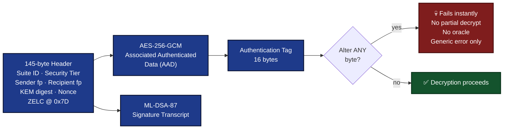
```mermaid
graph LR
    H["145-byte Header<br/>Suite ID · Security Tier<br/>Sender fp · Recipient fp<br/>KEM digest · Nonce<br/>ZELC @ 0x7D"] --> AAD["AES-256-GCM<br/>Associated Authenticated<br/>Data (AAD)"]
    H --> SIG["ML-DSA-87<br/>Signature Transcript"]
    AAD --> TAG["Authentication Tag<br/>16 bytes"]
    TAG --> VERDICT{"Alter ANY<br/>byte?"}
    VERDICT -- yes --> FAIL["💀 Fails instantly<br/>No partial decrypt<br/>No oracle<br/>Generic error only"]
    VERDICT -- no --> PASS["✅ Decryption proceeds"]

    classDef danger fill:#7f1d1d,color:#fff,stroke:#450a0a,stroke-width:2px
    classDef safe   fill:#14532d,color:#fff,stroke:#052e16,stroke-width:2px
    classDef info   fill:#1e3a8a,color:#fff,stroke:#0a1230,stroke-width:2px
    class FAIL danger
    class PASS safe
    class H,AAD,SIG,TAG info
```

**The header and the payload are MARRIED. You cannot divorce them. 🛑**

<p align="center">
  
</p>

---

### 4️⃣ &nbsp; Nightmare: Identity Confusion & the PKI Mess

> *Ciphertexts should never float without a verifiable identity. PGP got this catastrophically wrong. Most enterprise systems get it half-wrong.*

**How ZelEn kills it** — three files, three concerns, zero ambiguity:

```text
  identity@domain.com
  │
  ├── 🔑 identity.zkey   ←  Private key bundle
  │                         Argon2id-protected · Never leaves your machine
  │                         Contains: KEM secret key + DSA secret key
  │
  ├── 📬 identity.zpub   ←  Public key bundle — share freely
  │                         Contains: ML-KEM-1024 encapsulation key
  │                                   ML-DSA-87 verification key
  │                                   SHA3-256 fingerprint
  │
  └── 📜 identity.zcert  ←  Quantum-safe certificate — share freely
                            Your identity LOCKED to your .zpub
                            via ML-DSA signature
                            Subject · Domain · Metadata · Expiry
```

<p align="center">
  
</p>

---

### 5️⃣ &nbsp; Nightmare: The Black-Box Forensics Problem &nbsp; ⭐ &nbsp; *(Our Proudest Piece)*

> *Encrypted files look like random noise. Your DLP is blind. Your SIEM is blind. Your forensics team is blind. Incident responders cannot tell ZelEn from a malicious payload.*

**How ZelEn kills it** — the **ZELC integrity anchor**:

```text
  .zelen container — first 130 bytes:

  00000000:  5A 45 4C 45 4E   │  Z E L E N   ←  Magic @ 0x00
  00000005:  01               │  version
  00000006:  00               │  flags
  00000007:  05               │  security tier = 5 (Level 5)
  00000008:  01               │  header profile
  00000009:  01 01            │  suite ID = 0x0101 (PQ5)
            ...
  0000007D:  5A 45 4C 43      │  Z E L C   ←  ★ INTEGRITY ANCHOR @ exact 0x7D
            ━━━━━━━━━━━━━━━━━━━━━━━━━━━━━━━━━━━━━━━
  00000081:  [16-byte header authentication tag]
  00000091:  [KEM ciphertext length]
  00000095:  [1568-byte ML-KEM-1024 ciphertext...]
```

```text
  SIEM  →  carve ZELC @ 0x7D            →  classify instantly
  DLP   →  flag all .zelen traffic      →  policy enforcement
  IDS   →  signature-match byte pattern →  alert on exfil

  Parser: container missing ZELC @ 0x7D? →  REJECTED.
          Before ANY cryptographic operation begins.
          No key material touched. No oracle exposed. 🛡️
```

**Months. We spent MONTHS getting that byte map right. Because the header is the FIRST line of defense AND the FIRST signal to your security stack.**

<table>
<tr>
<td align="center" width="100%">
  <br/>
  <sub><b>Security-stack visibility</b> — the ZELC anchor makes encrypted objects classifiable.</sub>
</td>
</tr>
</table>

---

## 🤓 &nbsp; The Optional Paranoia Layers

> *For federal contracts. For trade secrets competitors would commit crimes to obtain. For engineers who trust no single algorithm — and are RIGHT not to.*

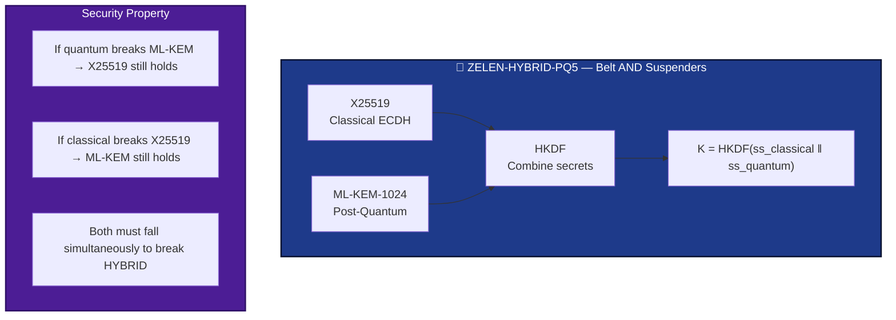
```mermaid
graph TB
    subgraph HYBRID["🔀 ZELEN-HYBRID-PQ5 — Belt AND Suspenders"]
        X25519["X25519<br/>Classical ECDH"] --> HKDF["HKDF<br/>Combine secrets"]
        MLKEM["ML-KEM-1024<br/>Post-Quantum"] --> HKDF
        HKDF --> K["K = HKDF(ss_classical ‖ ss_quantum)"]
    end

    subgraph NOTE["Security Property"]
        A["If quantum breaks ML-KEM → X25519 still holds"]
        B["If classical breaks X25519 → ML-KEM still holds"]
        C["Both must fall simultaneously to break HYBRID"]
    end

    classDef indigo fill:#1e3a8a,color:#fff,stroke:#0a1230,stroke-width:2px
    classDef violet fill:#4c1d95,color:#fff,stroke:#2e1065,stroke-width:2px
    class HYBRID indigo
    class NOTE violet
```

---

## 🏗️ &nbsp; The Vertical Integration

> *Other vendors give you a library. We give you a LANGUAGE that enforces a CRYPTOGRAPHIC LAW that is operated by a PLATFORM.*

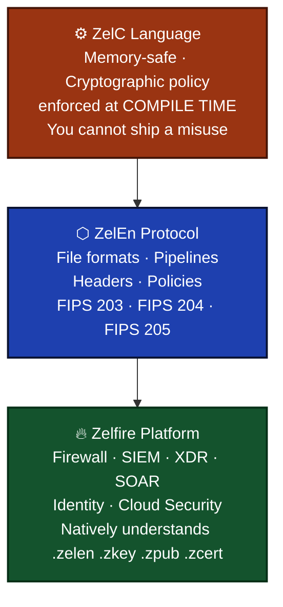
```mermaid
graph TB
    ZelC["⚙️ ZelC Language<br/>Memory-safe · Cryptographic policy<br/>enforced at COMPILE TIME<br/>You cannot ship a misuse"] --> ZelEn
    ZelEn["⬡ ZelEn Protocol<br/>File formats · Pipelines<br/>Headers · Policies<br/>FIPS 203 · FIPS 204 · FIPS 205"] --> Zelfire
    Zelfire["🔥 Zelfire Platform<br/>Firewall · SIEM · XDR · SOAR<br/>Identity · Cloud Security<br/>Natively understands .zelen .zkey .zpub .zcert"]

    classDef orange fill:#9a3412,color:#fff,stroke:#431407,stroke-width:2px
    classDef blue   fill:#1e40af,color:#fff,stroke:#0a1230,stroke-width:2px
    classDef green  fill:#14532d,color:#fff,stroke:#052e16,stroke-width:2px
    class ZelC orange
    class ZelEn blue
    class Zelfire green
```

---

## 📐 &nbsp; The Formal Security Guarantee

For the cryptographers reading this — **yes, we did the work.**

$$\mathsf{Adv}^{\mathsf{obj\text{-}sec}}_{\mathsf{ZelEn}}(\mathcal{A}) \;\leq\; \underbrace{\mathsf{Adv}^{\mathsf{IND\text{-}CCA2}}_{\mathsf{ML\text{-}KEM}}(\mathcal{B})}_{\text{negligible FIPS 203}} + \underbrace{\mathsf{Adv}^{\mathsf{AEAD}}_{\mathsf{GCM}}(\mathcal{C})}_{\text{negligible SP 800-38D}} + \underbrace{\mathsf{Adv}^{\mathsf{PRF}}_{\mathsf{KDF}}(\mathcal{D})}_{\text{negligible RFC 5869}} + \underbrace{\mathsf{Adv}^{\mathsf{EUF\text{-}CMA}}_{\mathsf{ML\text{-}DSA}}(\mathcal{E})}_{\text{negligible FIPS 204}} + \underbrace{\varepsilon_{\mathsf{CE}} + \varepsilon_{\mathsf{parse}}}_{\text{negligible}}$$

> [!IMPORTANT]
> | Property | Guarantee |
> |---|---|
> | Classical security | **≥ 256 bits** &nbsp; ✅ |
> | Quantum security | **≥ 128 bits** &nbsp; ✅ |
> | All terms negligible in the security parameter at NIST Level 5 | ✅ |

---

## 🎯 &nbsp; The Bottom Line

> [!CAUTION]
> ### The post-quantum era is not coming. &nbsp; **IT IS HERE.**
>
> Harvest-now-decrypt-later attacks are happening **RIGHT NOW**.  
> State-level adversaries are collecting your encrypted traffic.  
> They are betting on quantum computers maturing this decade.  
> They are betting your RSA and ECC will be retroactively broken.
>
> ### **D O &nbsp; N O T &nbsp; L E T &nbsp; T H E M &nbsp; W I N.**

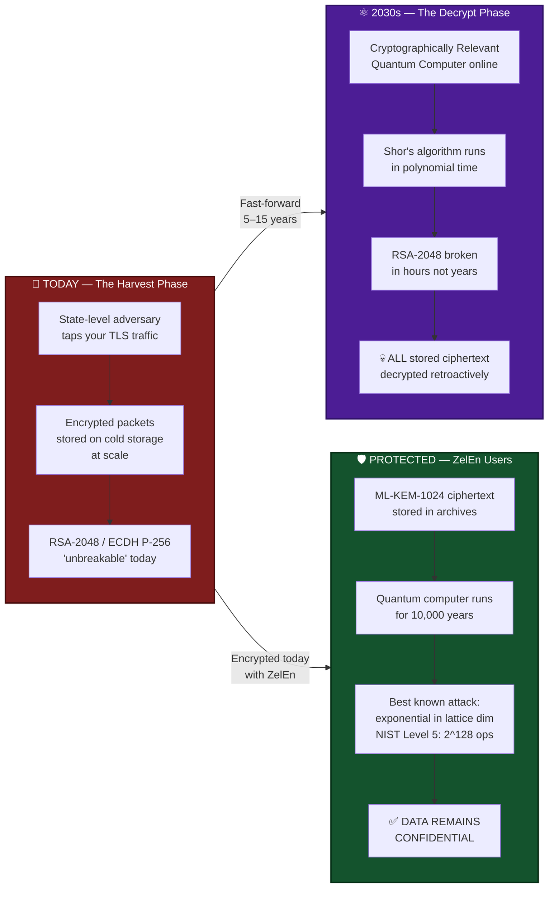
```mermaid
flowchart LR
    subgraph NOW["📡 TODAY — The Harvest Phase"]
        direction TB
        T1["State-level adversary<br/>taps your TLS traffic"]
        T2["Encrypted packets<br/>stored on cold storage<br/>at scale"]
        T3["RSA-2048 / ECDH P-256<br/>'unbreakable' today"]
        T1 --> T2 --> T3
    end

    subgraph FUTURE["⚛️ 2030s — The Decrypt Phase"]
        direction TB
        Q1["Cryptographically Relevant<br/>Quantum Computer online"]
        Q2["Shor's algorithm runs<br/>in polynomial time"]
        Q3["RSA-2048 broken<br/>in hours not years"]
        Q4["💀 ALL stored ciphertext<br/>decrypted retroactively"]
        Q1 --> Q2 --> Q3 --> Q4
    end

    subgraph SAFE["🛡️ PROTECTED — ZelEn Users"]
        direction TB
        Z1["ML-KEM-1024 ciphertext<br/>stored in archives"]
        Z2["Quantum computer runs<br/>for 10,000 years"]
        Z3["Best known attack:<br/>exponential in lattice dim<br/>NIST Level 5: 2^128 ops"]
        Z4["✅ DATA REMAINS<br/>CONFIDENTIAL"]
        Z1 --> Z2 --> Z3 --> Z4
    end

    NOW -->|"Fast-forward<br/>5–15 years"| FUTURE
    NOW -->|"Encrypted today<br/>with ZelEn"| SAFE

    classDef danger fill:#7f1d1d,color:#fff,stroke:#450a0a,stroke-width:2px
    classDef violet fill:#4c1d95,color:#fff,stroke:#2e1065,stroke-width:2px
    classDef safe   fill:#14532d,color:#fff,stroke:#052e16,stroke-width:2px
    class NOW danger
    class FUTURE violet
    class SAFE safe
```

The post-quantum era requires more than just new math. It requires:

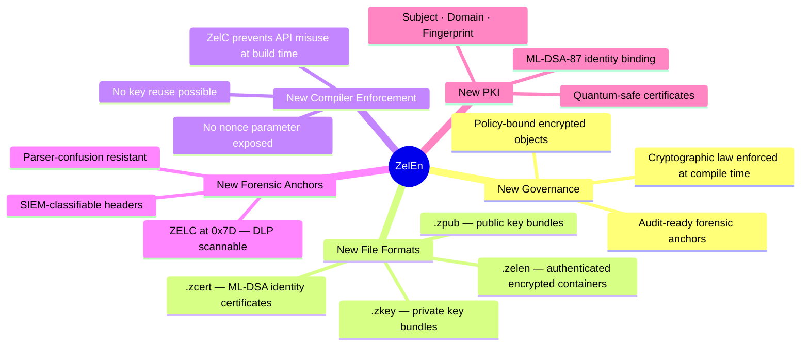
```mermaid
mindmap
  root((ZelEn))
    New Governance
      Cryptographic law enforced at compile time
      Policy-bound encrypted objects
      Audit-ready forensic anchors
    New File Formats
      .zkey — private key bundles
      .zpub — public key bundles
      .zcert — ML-DSA identity certificates
      .zelen — authenticated encrypted containers
    New Compiler Enforcement
      ZelC prevents API misuse at build time
      No nonce parameter exposed
      No key reuse possible
    New Forensic Anchors
      ZELC at 0x7D — DLP scannable
      SIEM-classifiable headers
      Parser-confusion resistant
    New PKI
      Quantum-safe certificates
      ML-DSA-87 identity binding
      Subject · Domain · Fingerprint
```

> [!TIP]
> NIST built the engines. &nbsp; We built the armored vehicle.  
> The math is **RIGHT**. &nbsp; The implementation is **BULLETPROOF**. &nbsp; The future is **HERE**. &nbsp; 🛡️🚀

---

<div align="center">

**👉 &nbsp; Generate your quantum keys right now: &nbsp; [zelen.rocheston.com](https://zelen.rocheston.com)**  
**👉 &nbsp; Full architecture & byte maps: &nbsp; [zelen.rocheston.com/how-it-works](https://zelen.rocheston.com/how-it-works)**  
**👉 &nbsp; The whitepaper: &nbsp; [zelen.rocheston.com/ZelEn_Whitepaper.pdf](https://zelen.rocheston.com/ZelEn_Whitepaper.pdf)**

`#ZelEn` &nbsp; `#Zelfire` &nbsp; `#ZelC` &nbsp; `#Rocheston` &nbsp; `#QuantumSafe` &nbsp; `#PostQuantum` &nbsp; `#NIST` &nbsp; `#PQC` &nbsp; `#MLKEM` &nbsp; `#MLDSA` &nbsp; `#Cryptography` &nbsp; `#CyberSecurity` &nbsp; `#CISO`

*RCCE is an ANAB-accredited, DoD 8140-approved advanced cybersecurity war school mapped to 16 DCWF job roles. Zelfire is exclusively licensed to RCCE engineers.*

</div>

<p align="center">
  
</p>

---

## 🌌 &nbsp; The Quantum Threat Timeline

<p align="center">
  
</p>

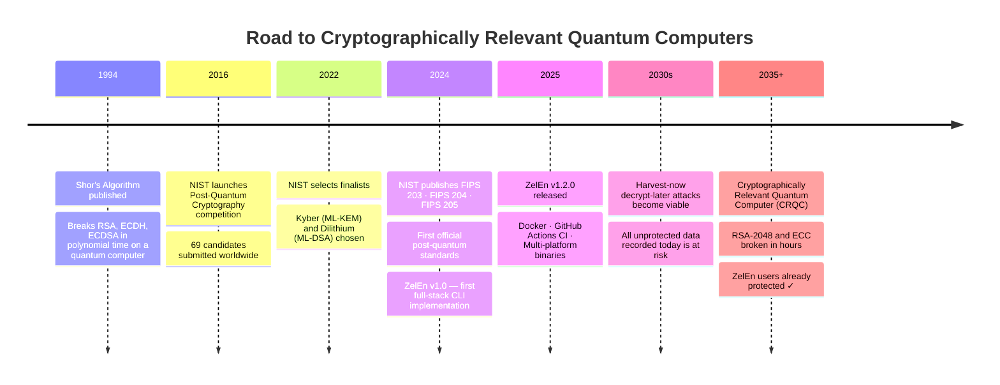
```mermaid
timeline
    title Road to Cryptographically Relevant Quantum Computers
    1994 : Shor's Algorithm published
         : Breaks RSA, ECDH, ECDSA in polynomial time on a quantum computer
    2016 : NIST launches Post-Quantum Cryptography competition
         : 69 candidates submitted worldwide
    2022 : NIST selects finalists
         : Kyber (ML-KEM) and Dilithium (ML-DSA) chosen
    2024 : NIST publishes FIPS 203 · FIPS 204 · FIPS 205
         : First official post-quantum standards
         : ZelEn v1.0 — first full-stack CLI implementation
    2025 : ZelEn v1.2.0 released
         : Docker · GitHub Actions CI · Multi-platform binaries
    2030s : Harvest-now decrypt-later attacks become viable
          : All unprotected data recorded today is at risk
    2035+ : Cryptographically Relevant Quantum Computer (CRQC)
          : RSA-2048 and ECC broken in hours
          : ZelEn users already protected ✓
```

---

## ⚔️ &nbsp; Classical vs. Quantum Security

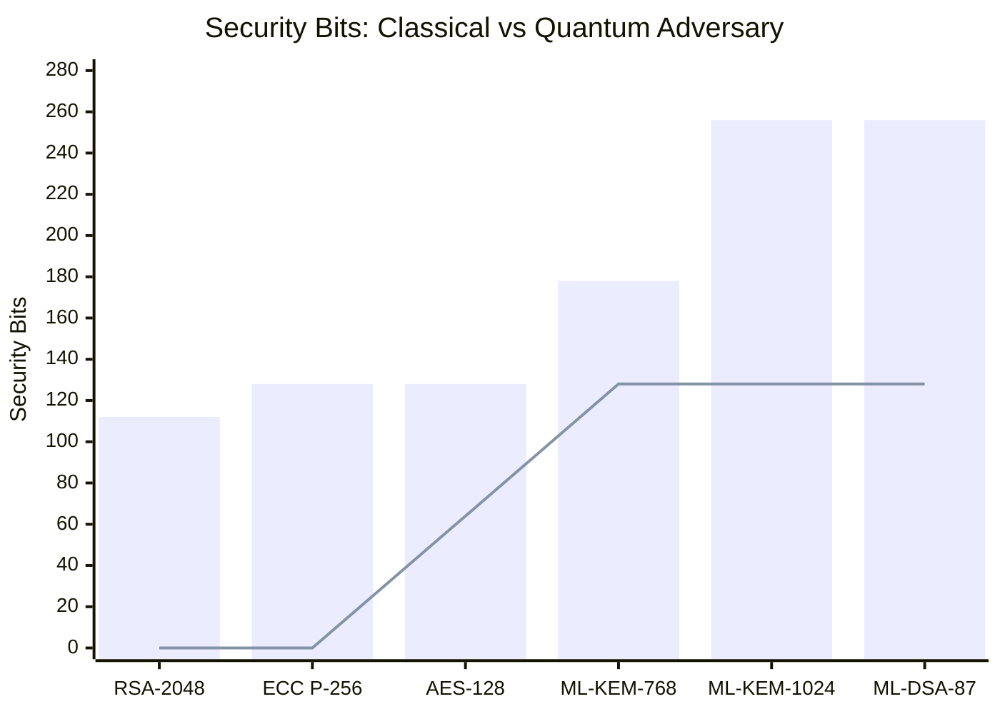
```mermaid
xychart-beta
    title "Security Bits: Classical vs Quantum Adversary"
    x-axis ["RSA-2048", "ECC P-256", "AES-128", "ML-KEM-768", "ML-KEM-1024", "ML-DSA-87"]
    y-axis "Security Bits" 0 --> 280
    bar [112, 128, 128, 178, 256, 256]
    line [0, 0, 64, 128, 128, 128]
```

> 🟦 &nbsp; Bar = Classical security bits &nbsp;|&nbsp; 🔶 &nbsp; Line = Post-quantum security bits (Grover / best known quantum attack)  
> RSA and ECC drop to **~0 bits** against a quantum computer running Shor's algorithm.

---

## 📐 &nbsp; Key & Ciphertext Size Comparison

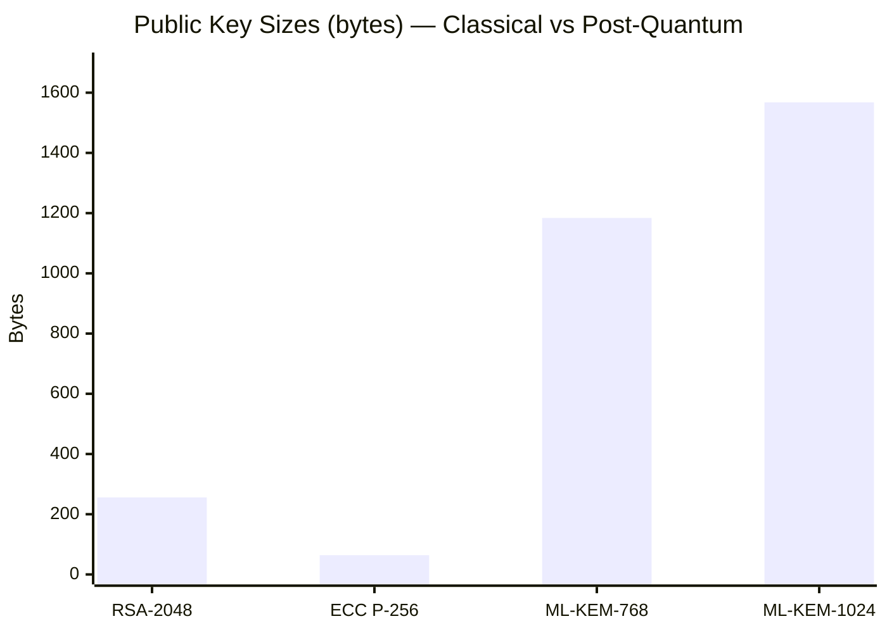
```mermaid
xychart-beta
    title "Public Key Sizes (bytes) — Classical vs Post-Quantum"
    x-axis ["RSA-2048", "ECC P-256", "ML-KEM-768", "ML-KEM-1024"]
    y-axis "Bytes" 0 --> 1700
    bar [256, 64, 1184, 1568]
```

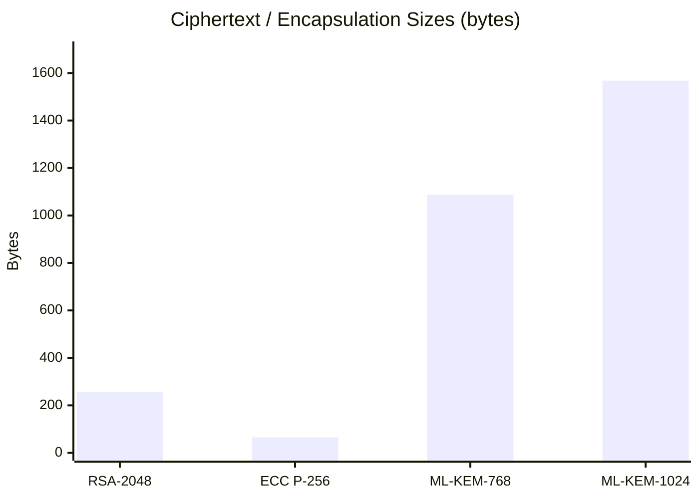
```mermaid
xychart-beta
    title "Ciphertext / Encapsulation Sizes (bytes)"
    x-axis ["RSA-2048", "ECC P-256", "ML-KEM-768", "ML-KEM-1024"]
    y-axis "Bytes" 0 --> 1700
    bar [256, 65, 1088, 1568]
```

---

## 🔐 &nbsp; ZelEn Cryptographic Stack

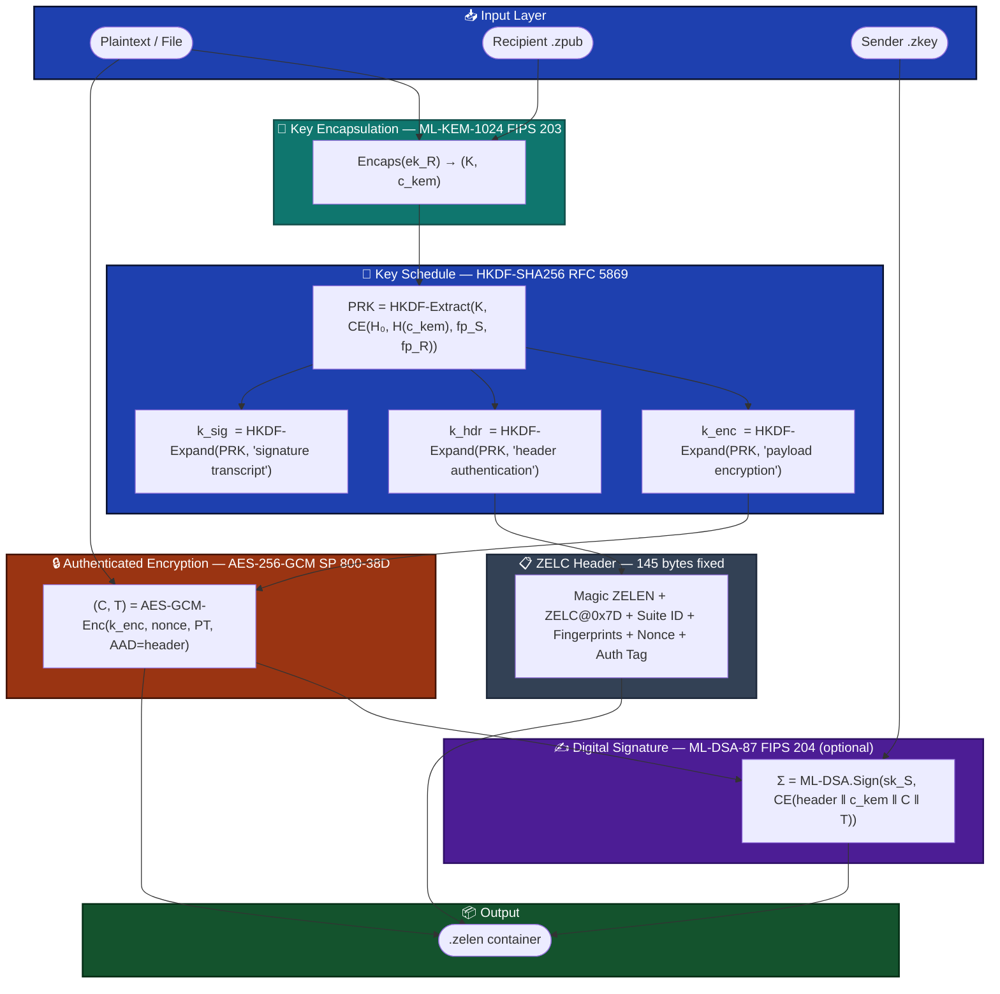
```mermaid
graph TB
    subgraph INPUT["📥 Input Layer"]
        PT([Plaintext / File])
        PK([Recipient .zpub])
        SK([Sender .zkey])
    end

    subgraph KEM["🔑 Key Encapsulation — ML-KEM-1024  FIPS 203"]
        E["Encaps(ek_R) → (K, c_kem)"]
    end

    subgraph KDF["🔀 Key Schedule — HKDF-SHA256  RFC 5869"]
        H["PRK = HKDF-Extract(K, CE(H₀, H(c_kem), fp_S, fp_R))"]
        K1["k_enc  = HKDF-Expand(PRK, 'payload encryption')"]
        K2["k_hdr  = HKDF-Expand(PRK, 'header authentication')"]
        K3["k_sig  = HKDF-Expand(PRK, 'signature transcript')"]
    end

    subgraph AEAD["🔒 Authenticated Encryption — AES-256-GCM  SP 800-38D"]
        G["(C, T) = AES-GCM-Enc(k_enc, nonce, PT, AAD=header)"]
    end

    subgraph SIG["✍️ Digital Signature — ML-DSA-87  FIPS 204 (optional)"]
        D["Σ = ML-DSA.Sign(sk_S, CE(header ‖ c_kem ‖ C ‖ T))"]
    end

    subgraph HDR["📋 ZELC Header — 145 bytes fixed"]
        Z["Magic ZELEN + ZELC@0x7D + Suite ID + Fingerprints + Nonce + Auth Tag"]
    end

    subgraph OUT["📦 Output"]
        ZC([".zelen container"])
    end

    PT --> E
    PK --> E
    SK --> D
    E --> H
    H --> K1 & K2 & K3
    K1 --> G
    K2 --> Z
    PT --> G
    G --> D
    G --> ZC
    D --> ZC
    Z --> ZC

    classDef teal   fill:#0f766e,color:#fff,stroke:#134e4a,stroke-width:2px
    classDef blue   fill:#1e40af,color:#fff,stroke:#0a1230,stroke-width:2px
    classDef orange fill:#9a3412,color:#fff,stroke:#431407,stroke-width:2px
    classDef violet fill:#4c1d95,color:#fff,stroke:#2e1065,stroke-width:2px
    classDef slate  fill:#334155,color:#fff,stroke:#1e293b,stroke-width:2px
    classDef green  fill:#14532d,color:#fff,stroke:#052e16,stroke-width:2px
    class INPUT blue
    class KEM teal
    class KDF blue
    class AEAD orange
    class SIG violet
    class HDR slate
    class OUT green
```

---

## 🔓 &nbsp; Decryption Pipeline — Fail-Closed

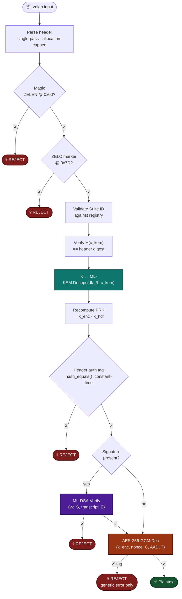
```mermaid
flowchart TD
    A(["📦 .zelen input"]) --> B["Parse header<br/>single-pass · allocation-capped"]
    B --> C{"Magic<br/>ZELEN @ 0x00?"}
    C -- ✗ --> F1(["💀 REJECT"])
    C -- ✓ --> D{"ZELC marker<br/>@ 0x7D?"}
    D -- ✗ --> F2(["💀 REJECT"])
    D -- ✓ --> E["Validate Suite ID<br/>against registry"]
    E --> F["Verify H(c_kem)<br/>== header digest"]
    F --> G["K ← ML-KEM.Decaps(dk_R, c_kem)"]
    G --> H["Recompute PRK<br/>→ k_enc · k_hdr"]
    H --> I{"Header auth tag<br/>hash_equals()  constant-time"}
    I -- ✗ --> F3(["💀 REJECT"])
    I -- ✓ --> J{"Signature<br/>present?"}
    J -- yes --> K["ML-DSA.Verify<br/>(vk_S, transcript, Σ)"]
    K -- ✗ --> F4(["💀 REJECT"])
    K -- ✓ --> L["AES-256-GCM.Dec<br/>(k_enc, nonce, C, AAD, T)"]
    J -- no --> L
    L -- ✗ tag --> F5(["💀 REJECT<br/>generic error only"])
    L -- ✓ --> M(["✅ Plaintext"])

    classDef danger fill:#7f1d1d,color:#fff,stroke:#450a0a,stroke-width:2px
    classDef safe   fill:#14532d,color:#fff,stroke:#052e16,stroke-width:2px
    classDef teal   fill:#0f766e,color:#fff,stroke:#134e4a,stroke-width:2px
    classDef violet fill:#4c1d95,color:#fff,stroke:#2e1065,stroke-width:2px
    classDef orange fill:#9a3412,color:#fff,stroke:#431407,stroke-width:2px
    class F1,F2,F3,F4,F5 danger
    class M safe
    class G teal
    class K violet
    class L orange
```

---

## 👥 &nbsp; Alice → Bob: End-to-End Sequence

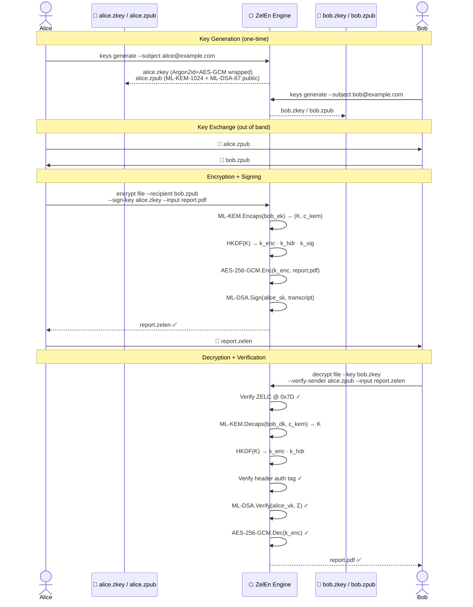
```mermaid
sequenceDiagram
    actor Alice
    participant AKey as 🔑 alice.zkey / alice.zpub
    participant ZelEn as ⬡ ZelEn Engine
    participant BKey as 🔑 bob.zkey / bob.zpub
    actor Bob

    Note over Alice,Bob: Key Generation (one-time)
    Alice->>ZelEn: keys generate --subject alice@example.com
    ZelEn-->>AKey: alice.zkey (Argon2id+AES-GCM wrapped)<br/>alice.zpub (ML-KEM-1024 + ML-DSA-87 public)
    Bob->>ZelEn: keys generate --subject bob@example.com
    ZelEn-->>BKey: bob.zkey / bob.zpub

    Note over Alice,Bob: Key Exchange (out of band)
    Alice->>Bob: 📨 alice.zpub
    Bob->>Alice: 📨 bob.zpub

    Note over Alice,Bob: Encryption + Signing
    Alice->>ZelEn: encrypt file --recipient bob.zpub<br/>--sign-key alice.zkey --input report.pdf
    ZelEn->>ZelEn: ML-KEM.Encaps(bob_ek) → (K, c_kem)
    ZelEn->>ZelEn: HKDF(K) → k_enc · k_hdr · k_sig
    ZelEn->>ZelEn: AES-256-GCM.Enc(k_enc, report.pdf)
    ZelEn->>ZelEn: ML-DSA.Sign(alice_sk, transcript)
    ZelEn-->>Alice: report.zelen ✅

    Alice->>Bob: 📨 report.zelen

    Note over Alice,Bob: Decryption + Verification
    Bob->>ZelEn: decrypt file --key bob.zkey<br/>--verify-sender alice.zpub --input report.zelen
    ZelEn->>ZelEn: Verify ZELC @ 0x7D ✓
    ZelEn->>ZelEn: ML-KEM.Decaps(bob_dk, c_kem) → K
    ZelEn->>ZelEn: HKDF(K) → k_enc · k_hdr
    ZelEn->>ZelEn: Verify header auth tag ✓
    ZelEn->>ZelEn: ML-DSA.Verify(alice_vk, Σ) ✓
    ZelEn->>ZelEn: AES-256-GCM.Dec(k_enc) ✓
    ZelEn-->>Bob: report.pdf ✅
```

---

## 🧮 &nbsp; Algorithm Suite Breakdown

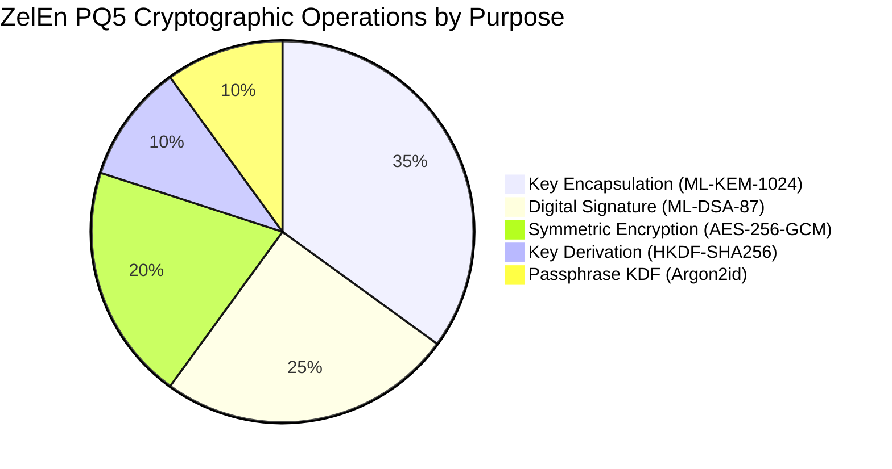
```mermaid
pie title ZelEn PQ5 Cryptographic Operations by Purpose
    "Key Encapsulation (ML-KEM-1024)" : 35
    "Digital Signature (ML-DSA-87)" : 25
    "Symmetric Encryption (AES-256-GCM)" : 20
    "Key Derivation (HKDF-SHA256)" : 10
    "Passphrase KDF (Argon2id)" : 10
```

---

## 🌌 &nbsp; The Quantum Threat Model

<p align="center">
  
</p>

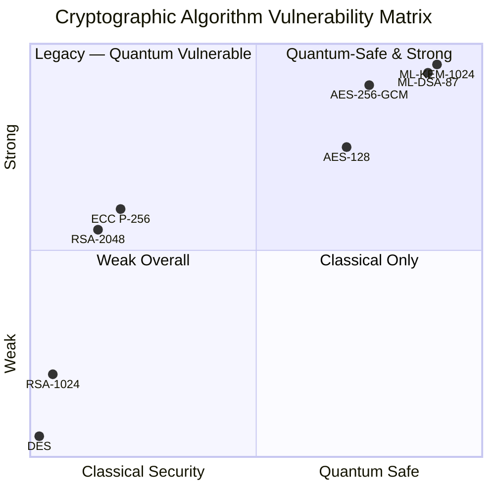
```mermaid
quadrantChart
    title Cryptographic Algorithm Vulnerability Matrix
    x-axis "Classical Security" --> "Quantum Safe"
    y-axis "Weak" --> "Strong"
    quadrant-1 Quantum-Safe & Strong
    quadrant-2 Legacy — Quantum Vulnerable
    quadrant-3 Weak Overall
    quadrant-4 Classical Only
    ML-KEM-1024: [0.90, 0.95]
    ML-DSA-87: [0.88, 0.93]
    AES-256-GCM: [0.75, 0.90]
    RSA-2048: [0.15, 0.55]
    ECC P-256: [0.20, 0.60]
    RSA-1024: [0.05, 0.20]
    DES: [0.02, 0.05]
    AES-128: [0.70, 0.75]
```

---

## 📦 &nbsp; The `.zelen` Binary Container — Byte Map

<p align="center">
  
</p>


```mermaid
graph LR
    subgraph HEADER["📋 145-byte Fixed Header"]
        direction TB
        A["0x00 ── 5B ── Magic: ZELEN"]
        B["0x05 ── 1B ── Format Version"]
        C["0x06 ── 1B ── Flags"]
        D["0x07 ── 1B ── Security Tier"]
        E["0x08 ── 1B ── Header Profile"]
        F["0x09 ── 2B ── Suite ID (BE uint16)"]
        G["0x0B ── 2B ── Certificate Type"]
        H["0x0D ── 4B ── Payload Length (BE uint32)"]
        I["0x11 ── 32B ── Sender Fingerprint SHA3-256"]
        J["0x31 ── 32B ── Recipient Fingerprint SHA3-256"]
        K["0x51 ── 32B ── KEM Ciphertext Digest SHA3-256"]
        L["0x71 ── 12B ── AES-GCM Nonce (12 random bytes)"]
        M["━━━━━━━━━━━━━━━━━━━━━━━━━━━━"]
        N["⭐ 0x7D ── 4B ── ZELC Integrity Anchor"]
        O["━━━━━━━━━━━━━━━━━━━━━━━━━━━━"]
        P["0x81 ── 16B ── Header Authentication Tag"]
        Q["0x91 ── 4B  ── KEM Ciphertext Length"]
    end

    subgraph BODY["📦 Variable Body"]
        direction TB
        R["0x95 ── 1568B ── ML-KEM-1024 Ciphertext"]
        S["── * ── AES-256-GCM Ciphertext + 16B GCM Tag"]
        T["── * ── ML-DSA-87 Signature (4627B, optional)"]
    end

    HEADER --> BODY

    classDef gold   fill:#b45309,color:#fff,stroke:#78350f,stroke-width:2px
    classDef indigo fill:#1e3a8a,color:#fff,stroke:#0a1230,stroke-width:2px
    classDef green  fill:#14532d,color:#fff,stroke:#052e16,stroke-width:2px
    class N gold
    class HEADER indigo
    class BODY green
```

---

## 🔑 &nbsp; CLI Usage

### 🔒 &nbsp; Encrypt

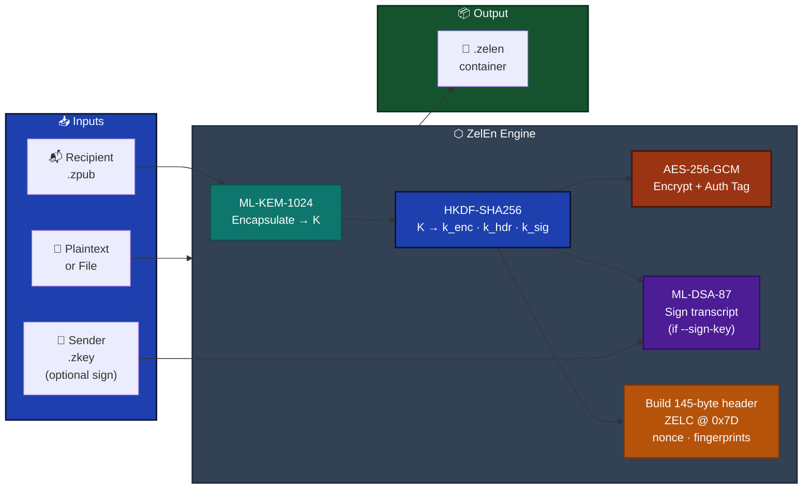
```mermaid
flowchart LR
    subgraph IN["📥 Inputs"]
        direction TB
        PT["📄 Plaintext<br/>or File"]
        PUB["📬 Recipient<br/>.zpub"]
        SK["🔑 Sender<br/>.zkey<br/>(optional sign)"]
    end

    subgraph ENGINE["⬡ ZelEn Engine"]
        direction TB
        KEM["ML-KEM-1024<br/>Encapsulate → K"]
        KDF["HKDF-SHA256<br/>K → k_enc · k_hdr · k_sig"]
        AES["AES-256-GCM<br/>Encrypt + Auth Tag"]
        DSA["ML-DSA-87<br/>Sign transcript<br/>(if --sign-key)"]
        HDR["Build 145-byte header<br/>ZELC @ 0x7D<br/>nonce · fingerprints"]
        KEM --> KDF --> AES
        KDF --> DSA
        KDF --> HDR
    end

    subgraph OUT["📦 Output"]
        ZC["🔐 .zelen<br/>container"]
    end

    PT --> ENGINE
    PUB --> KEM
    SK --> DSA
    ENGINE --> ZC

    classDef blue   fill:#1e40af,color:#fff,stroke:#0a1230,stroke-width:2px
    classDef slate  fill:#334155,color:#fff,stroke:#1e293b,stroke-width:2px
    classDef green  fill:#14532d,color:#fff,stroke:#052e16,stroke-width:2px
    classDef teal   fill:#0f766e,color:#fff,stroke:#134e4a,stroke-width:2px
    classDef orange fill:#9a3412,color:#fff,stroke:#431407,stroke-width:2px
    classDef violet fill:#4c1d95,color:#fff,stroke:#2e1065,stroke-width:2px
    classDef gold   fill:#b45309,color:#fff,stroke:#78350f,stroke-width:2px
    class IN blue
    class ENGINE slate
    class OUT green
    class KEM teal
    class KDF blue
    class AES orange
    class DSA violet
    class HDR gold
```

### 🔓 &nbsp; Decrypt


```mermaid
flowchart LR
    subgraph IN2["📥 Inputs"]
        direction TB
        ZC2["🔐 .zelen<br/>container"]
        KEY["🔑 .zkey<br/>(private)"]
        PASS["🔒 Passphrase<br/>(env / file / prompt)"]
    end

    subgraph ENGINE2["⬡ ZelEn Engine"]
        direction TB
        CHK1["Parse header<br/>Verify ZELC @ 0x7D"]
        CHK2["Unwrap .zkey<br/>Argon2id + AES-GCM"]
        DEC["ML-KEM-1024<br/>Decapsulate → K"]
        KDF2["HKDF-SHA256<br/>→ k_enc · k_hdr"]
        AUTH["Verify header<br/>auth tag — constant-time"]
        VFY["ML-DSA-87<br/>Verify signature<br/>(if signed)"]
        AESD["AES-256-GCM<br/>Decrypt + Auth"]
        CHK1 --> CHK2 --> DEC --> KDF2 --> AUTH --> VFY --> AESD
    end

    subgraph OUT2["📤 Output"]
        PT2["📄 Plaintext<br/>or File"]
    end

    subgraph FAIL["💀 Any failure"]
        ERR["Generic error<br/>No oracle<br/>No partial data"]
    end

    ZC2 --> ENGINE2
    KEY --> CHK2
    PASS --> CHK2
    AESD --> PT2
    CHK1 -. "bad magic / ZELC" .-> ERR
    AUTH -. "tag mismatch" .-> ERR
    VFY  -. "bad signature" .-> ERR
    AESD -. "bad GCM tag" .-> ERR

    classDef blue   fill:#1e40af,color:#fff,stroke:#0a1230,stroke-width:2px
    classDef slate  fill:#334155,color:#fff,stroke:#1e293b,stroke-width:2px
    classDef green  fill:#14532d,color:#fff,stroke:#052e16,stroke-width:2px
    classDef danger fill:#7f1d1d,color:#fff,stroke:#450a0a,stroke-width:2px
    classDef gold   fill:#b45309,color:#fff,stroke:#78350f,stroke-width:2px
    classDef violet fill:#4c1d95,color:#fff,stroke:#2e1065,stroke-width:2px
    classDef teal   fill:#0f766e,color:#fff,stroke:#134e4a,stroke-width:2px
    classDef orange fill:#9a3412,color:#fff,stroke:#431407,stroke-width:2px
    class IN2 blue
    class ENGINE2 slate
    class OUT2 green
    class FAIL danger
    class CHK1 gold
    class CHK2 violet
    class DEC teal
    class KDF2 blue
    class AUTH gold
    class VFY violet
    class AESD orange
```

---

### 🔐 &nbsp; Key Management

<p align="center">
  
</p>

```bash
# Generate a PQ5 key pair (ML-KEM-1024 + ML-DSA-87) — default suite
zelen keys generate --subject alice@example.com --name "Alice" --out alice
# → alice.zkey  (private, passphrase-protected)
# → alice.zpub  (public, share freely)

# Generate with specific suite
zelen keys generate --subject bob@example.com --suite pq3 --out bob --ask-passphrase

# Generate with passphrase from env
ZELEN_PASS=my-passphrase \
  zelen keys generate --subject ci@example.com --suite pq5 --out ci --passphrase-env ZELEN_PASS

# Generate with passphrase file and expiry
zelen keys generate --subject alice@example.com \
  --passphrase-file /run/secrets/pass \
  --expires 2026-01-01 \
  --out alice

# Inspect keys (no passphrase needed)
zelen keys inspect alice.zkey
zelen keys inspect alice.zpub
zelen keys inspect alice.zpub --json
```

### 📝 &nbsp; Text Encryption & Decryption

```bash
# Encrypt a message
zelen encrypt text \
  --recipient alice.zpub \
  --text "Hello, quantum world!" \
  --out message.zelen

# Encrypt and sign (prove sender identity)
zelen encrypt text \
  --recipient alice.zpub \
  --text "Signed by Bob" \
  --sign-key bob.zkey \
  --out signed-message.zelen

# Encrypt via stdin → stdout (pipe-friendly)
echo "Secret payload" | zelen encrypt text \
  --recipient alice.zpub --stdin --stdout > msg.zelen

# Decrypt — passphrase from env
ZELEN_PASS=passphrase \
  zelen decrypt text \
  --key alice.zkey --passphrase-env ZELEN_PASS --input message.zelen

# Decrypt — passphrase from file
zelen decrypt text \
  --key alice.zkey --passphrase-file /run/secrets/pass --input message.zelen

# Decrypt — interactive prompt
zelen decrypt text --key alice.zkey --ask-passphrase --input message.zelen
```

### 📁 &nbsp; File Encryption & Decryption

```bash
# Encrypt a file
zelen encrypt file \
  --recipient alice.zpub \
  --input report.pdf \
  --out report.zelen

# Encrypt with signing and specific suite
zelen encrypt file \
  --recipient alice.zpub \
  --input archive.tar.gz \
  --sign-key bob.zkey \
  --suite pq5 \
  --out archive.zelen

# Decrypt a file
zelen decrypt file \
  --key alice.zkey \
  --passphrase-env ZELEN_PASS \
  --input report.zelen \
  --out report.pdf

# Decrypt and verify sender
zelen decrypt file \
  --key alice.zkey \
  --passphrase-env ZELEN_PASS \
  --input report.zelen \
  --out report.pdf \
  --verify-sender bob.zpub
```

### ✍️ &nbsp; Sign & Verify

```bash
# Sign a file with ML-DSA-87
zelen sign \
  --key alice.zkey \
  --passphrase-file /run/secrets/pass \
  --input report.pdf \
  --out report.sig

# Sign with ASCII armor (safe for email)
zelen sign \
  --key alice.zkey \
  --passphrase-file /run/secrets/pass \
  --input report.pdf \
  --out report.sig.asc \
  --armor

# Verify a signature
zelen verify \
  --pub-key alice.zpub \
  --input report.pdf \
  --signature report.sig

# Verify with context string
zelen verify \
  --pub-key alice.zpub \
  --input report.pdf \
  --signature report.sig \
  --context "contract-v2"
```

### 🛡️ &nbsp; Armor / Dearmor

```bash
# Convert binary .zelen to ASCII armor (safe for email, pastebins)
zelen armor message.zelen --out message.zelen.asc

# Convert ASCII armor back to binary
zelen dearmor message.zelen.asc --out message.zelen
```

### 🔍 &nbsp; Inspect & Container

```bash
# Inspect any ZelEn file — keys, containers, certs, signatures
zelen inspect alice.zkey
zelen inspect alice.zpub
zelen inspect message.zelen --header-map
zelen inspect message.zelen --json
zelen inspect report.sig
```

### ⚙️ &nbsp; System

```bash
zelen doctor                      # System health check
zelen self-test                   # Run all 12 cryptographic self-tests
zelen bench                       # Performance benchmarks
zelen version                     # Version + provider + build info
zelen version --json              # JSON output
zelen completions bash > /etc/bash_completion.d/zelen
zelen completions zsh  > ~/.zsh/completions/_zelen
zelen playground                  # Local web UI at http://localhost:8888
zelen playground --port 9000 --no-open
```

### 🤝 &nbsp; Complete Alice → Bob Workflow

<table>
<tr>
<td align="center" width="50%">
  <br/>
  <sub><b>Message capsule</b> — encrypt, sign, and authenticate before delivery.</sub>
</td>
<td align="center" width="50%">
  <br/>
  <sub><b>Alice to Bob</b> — one signed `.zelen` container travels across the secure pathway.</sub>
</td>
</tr>
</table>

```bash
# 1. Both generate key pairs
zelen keys generate --subject alice@example.com --name "Alice" --out alice
zelen keys generate --subject bob@example.com   --name "Bob"   --out bob

# 2. Exchange public keys (share .zpub freely)

# 3. Bob encrypts and signs for Alice
zelen encrypt text \
  --recipient alice.zpub \
  --text "Meeting at 3pm. Quantum-safe." \
  --sign-key bob.zkey \
  --out for-alice.zelen

# 4. Alice decrypts and verifies Bob's signature
ZELEN_PASS=alice-pass \
  zelen decrypt text \
  --key alice.zkey --passphrase-env ZELEN_PASS \
  --input for-alice.zelen \
  --verify-sender bob.zpub

# 5. Inspect the container byte structure
zelen inspect for-alice.zelen --header-map
```

---

## 🐳 &nbsp; Docker

```bash
# Launch web playground
docker run -d -p 8888:8888 rocheston/zelen:latest
# → http://localhost:8888

# CLI alias
alias zelen='docker run --rm -v $(pwd):/data -w /data rocheston/zelen:latest'
zelen keys generate --subject alice@example.com --out alice
zelen encrypt file --recipient alice.zpub --input secret.pdf --out secret.zelen
```

```yaml
# docker-compose.yml
services:
  zelen:
    image: rocheston/zelen:latest
    ports:
      - "8888:8888"
    restart: unless-stopped
```

---

## ⚙️ &nbsp; GitHub Actions CI

The full cryptographic lifecycle is verified automatically on every push:

<table>
<tr>
<td align="center" width="45%">
  <br/>
  <sub><b>Lifecycle proof</b> — keys, encryption, inspect, sign, verify, decrypt, and tamper test.</sub>
</td>
<td align="center" width="55%">
  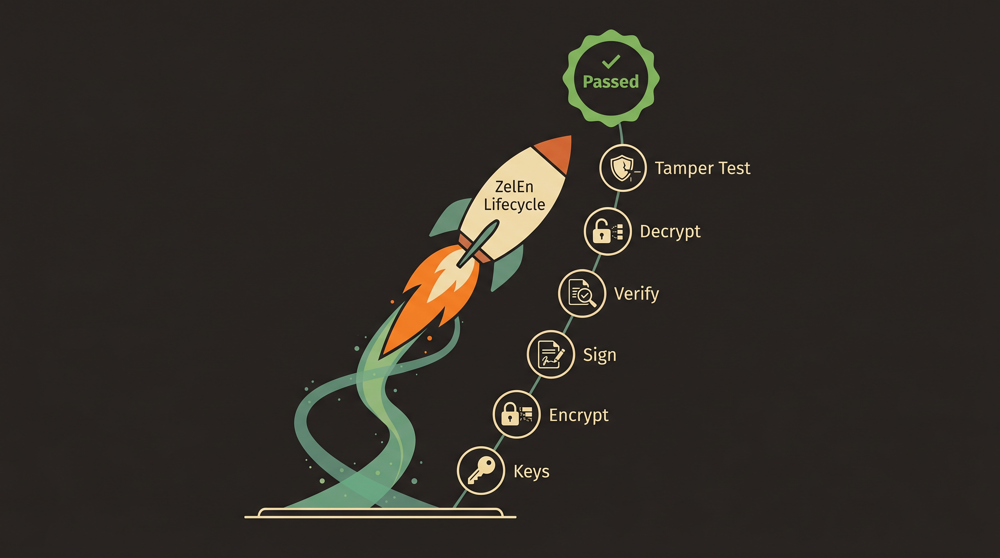<br/>
  <sub><b>End-to-end gate</b> — the release path only passes when the full crypto lifecycle succeeds.</sub>
</td>
</tr>
</table>

[](https://github.com/rocheston/zelen/actions/workflows/zelen-full-lifecycle.yml)


```mermaid
graph LR
    A([Push to main]) --> B[Pull rocheston/zelen:latest]
    B --> C[Generate PQ5 Keys]
    C --> D[Encrypt File]
    D --> E["Inspect Container<br/>ZELC @ 0x7D ✓"]
    E --> F[Sign ML-DSA-87]
    F --> G[Verify Signature ✓]
    G --> H[Decrypt File]
    H --> I[SHA256 Integrity ✓]
    I --> J[Encrypt Text]
    J --> K[Decrypt Text ✓]
    K --> L[Armor → Dearmor]
    L --> M["Tamper Detection<br/>Fails Closed ✓"]
    M --> N([Upload Artifacts])

    classDef blue   fill:#1e40af,color:#fff,stroke:#0a1230,stroke-width:2px
    classDef green  fill:#14532d,color:#fff,stroke:#052e16,stroke-width:2px
    classDef gold   fill:#b45309,color:#fff,stroke:#78350f,stroke-width:2px
    classDef violet fill:#4c1d95,color:#fff,stroke:#2e1065,stroke-width:2px
    classDef teal   fill:#0f766e,color:#fff,stroke:#134e4a,stroke-width:2px
    classDef danger fill:#7f1d1d,color:#fff,stroke:#450a0a,stroke-width:2px
    class A blue
    class N green
    class E gold
    class G violet
    class I teal
    class M danger
```

[View latest run →](https://github.com/rocheston/zelen/actions/workflows/zelen-full-lifecycle.yml)

---

## 🏛️ &nbsp; Mathematical Foundations

### The Lattice Geometry — Intuitively

```text
Classical cryptography (RSA):          Lattice cryptography (ML-KEM):

  n = p × q                             b = As + e  (mod q)
  │                                     │
  └─ Finding p,q from n:                └─ Finding s from (A, b):
     Hard classically (~112 bits)           Hard classically AND quantum
     BROKEN by Shor's algorithm             Best quantum attack: Grover
     on a quantum computer                  (still exponential in lattice dim)

  Security collapses to ~0 bits         Security: ~128 bits post-quantum
  with a CRQC                           at ML-KEM-1024 (NIST Level 5)
```

### MLWE Problem

$$\text{MLWE}_{k,n,q,\chi}: \quad \mathbf{b} = \mathbf{A}\mathbf{s} + \mathbf{e} \pmod{q}$$

where $\mathbf{A} \overset{r}{\leftarrow} \mathcal{R}_q^{k \times k}$, $\;\mathbf{s}, \mathbf{e} \overset{r}{\leftarrow} \chi^k$ (centered binomial), $\;\mathcal{R}_q = \mathbb{Z}_q[X]/(X^n+1)$

### ZelEn Key Schedule

$$k_{\mathsf{enc}} \;\|\; k_{\mathsf{hdr}} \;\|\; k_{\sigma} \;=\; \mathsf{HKDF\text{-}SHA256}\!\left(K_{\mathsf{KEM}},\; \mathsf{CE}(H_0,\, H(\mathbf{c}_{\mathsf{kem}}),\, \mathsf{fp}_S,\, \mathsf{fp}_R,\, \mathsf{suite})\right)$$

### Formal Security Theorem

$$\mathsf{Adv}^{\mathsf{obj\text{-}sec}}_{\mathsf{ZelEn}}(\mathcal{A}) \;\leq\; \mathsf{Adv}^{\mathsf{IND\text{-}CCA2}}_{\mathsf{ML\text{-}KEM}}(\mathcal{B}) + \mathsf{Adv}^{\mathsf{AEAD}}_{\mathsf{GCM}}(\mathcal{C}) + \mathsf{Adv}^{\mathsf{PRF}}_{\mathsf{KDF}}(\mathcal{D}) + \mathsf{Adv}^{\mathsf{EUF\text{-}CMA}}_{\mathsf{ML\text{-}DSA}}(\mathcal{E}) + \varepsilon_{\mathsf{CE}}$$

All terms **negligible** in $\lambda$ at NIST Level 5.

---

## 🔬 &nbsp; Algorithm Suite Registry

| Suite ID | Name | KEM | Signature | NIST Level | Status |
|:--:|:--|:--|:--|:--:|:--:|
| `0x0100` | ZELEN-PQ3            | ML-KEM-768  | ML-DSA-65               | Level 3 | ✅ Enabled |
| `0x0101` | **ZELEN-PQ5**        | **ML-KEM-1024** | **ML-DSA-87**       | **Level 5** | ⭐ **Default** |
| `0x0102` | ZELEN-PQ5-SLH        | ML-KEM-1024 | ML-DSA-87 + SLH-DSA-256 | Level 5 | ✅ Enabled |
| `0x0200+` | MTE Hybrid          | ML-KEM + X25519 | —                   | Level 5 | 🔜 Planned |

```mermaid
graph LR
    subgraph PQ3["🔵 ZELEN-PQ3 · Suite 0x0100"]
        A1["ML-KEM-768"] --> A2["ML-DSA-65"]
        A2 --> A3["NIST Level 3<br/>~178-bit classical<br/>~128-bit quantum"]
    end
    subgraph PQ5["⭐ ZELEN-PQ5 · Suite 0x0101  DEFAULT"]
        B1["ML-KEM-1024"] --> B2["ML-DSA-87"]
        B2 --> B3["NIST Level 5<br/>~256-bit classical<br/>~128-bit quantum"]
    end
    subgraph SLH["🛡️ ZELEN-PQ5-SLH · Suite 0x0102"]
        C1["ML-KEM-1024"] --> C2["ML-DSA-87<br/>+SLH-DSA-256"]
        C2 --> C3["NIST Level 5<br/>Hash-based sig backup<br/>Stateless · No state mgmt"]
    end

    classDef blue   fill:#1e40af,color:#fff,stroke:#0a1230,stroke-width:2px
    classDef green  fill:#14532d,color:#fff,stroke:#052e16,stroke-width:2px
    classDef violet fill:#4c1d95,color:#fff,stroke:#2e1065,stroke-width:2px
    class PQ3 blue
    class PQ5 green
    class SLH violet
```

---

## ⬡ &nbsp; ZelEn Encryption in the ZelC Compiler

> *ZelEn is not just a CLI tool — it is the cryptographic enforcement layer baked into the ZelC language compiler. ZelC uses quantum encryption — ML-KEM + ML-DSA — exclusively. RSA and ECC do not exist in ZelC. You cannot write a ZelC program that uses classical cryptography.*

<p align="center">
  
</p>

```mermaid
flowchart TD
    subgraph ZELC["⚙️ ZelC Compiler"]
        direction TB
        SRC["ZelC Source Code<br/>encrypt(data, recipient)"]
        PARSE["Compiler parses<br/>encrypt / sign / decrypt<br/>keyword primitives"]
        POLICY["Policy engine checks:<br/>✓ Key type matches operation<br/>✓ Suite authorized for context<br/>✓ Recipient identity resolvable<br/>✓ No key reuse across domains"]
        EMIT["Emit LLVM IR<br/>with ZelEn calls<br/>hard-wired in"]
        BIN["Native Binary<br/>Post-quantum by default<br/>Misuse = compile error"]
        SRC --> PARSE --> POLICY --> EMIT --> BIN
    end

    subgraph WRONG["❌ What ZelC REJECTS at Compile Time"]
        direction TB
        W1["RSA · ECC · ECDH · ECDSA<br/>← Classical crypto: not in language"]
        W2["manual nonce / manual IV<br/>← No raw cipher access"]
        W3["same key for enc + sign<br/>← Compiler rejects key reuse"]
        W4["MD5 · SHA-1 · DES · 3DES<br/>← Weak primitives: not in stdlib"]
    end

    subgraph RIGHT["✅ What ZelC Gives You"]
        direction TB
        R1["encrypt(payload, recipient.zpub)<br/>Full PQ5 pipeline auto-wired"]
        R2["sign(payload, sender.zkey)<br/>ML-DSA-87 transcript auto-built"]
        R3["decrypt(container, my.zkey)<br/>Fail-closed · verified · zeroized"]
    end

    ZELC --> RIGHT
    WRONG -. "compile error<br/>not possible" .-> ZELC

    classDef orange fill:#9a3412,color:#fff,stroke:#431407,stroke-width:2px
    classDef danger fill:#7f1d1d,color:#fff,stroke:#450a0a,stroke-width:2px
    classDef green  fill:#14532d,color:#fff,stroke:#052e16,stroke-width:2px
    class ZELC orange
    class WRONG danger
    class RIGHT green
```

<div align="center">

<table>
<tr>
<td align="center" width="30%"><h3>🚫</h3><b>RSA / ECC / Classical</b><br/><sub>Not in ZelC language<br/>Cannot be expressed or called</sub></td>
<td align="center" width="40%"><h3>⬡</h3><b>ZelEn Quantum Engine</b><br/><sub>ML-KEM-1024 + ML-DSA-87<br/>The only path — compile-time enforced</sub></td>
<td align="center" width="30%"><h3>✅</h3><b>Quantum-Safe Binary</b><br/><sub>Every build · every target<br/>FIPS 203 + 204 compliant</sub></td>
</tr>
</table>

> **The compiler is the cryptographer.**  
> ZelC has no RSA. ZelC has no ECC. ZelC has no classical key exchange.  
> Every ZelC binary is quantum-safe **by construction** — ML-KEM + ML-DSA, hard-wired, enforced at compile time.

</div>

---

## 📊 &nbsp; Performance

```mermaid
xychart-beta
    title "Operation Latency (ms) — ML-KEM-1024 + ML-DSA-87 on Linux x86_64"
    x-axis ["Key Gen", "KEM Encaps", "KEM Decaps", "Sign", "Verify", "AES-GCM 1MB", "HKDF"]
    y-axis "Milliseconds" 0 --> 210
    bar [180, 3, 3, 10, 6, 1, 0]
```

> Key generation is dominated by Argon2id (64 MB RAM, 3 passes) — intentionally slow to resist brute force.

---

## 🔐 &nbsp; Security Architecture

<table>
<tr>
<td align="center" width="50%">
  <br/>
  <sub><b>Authenticate first</b> — no plaintext is released before the container is verified.</sub>
</td>
<td align="center" width="50%">
  <br/>
  <sub><b>Tamper rejection</b> — corrupted containers fail before partial decrypt is possible.</sub>
</td>
</tr>
</table>

```mermaid
graph TB
    subgraph GUARANTEES["Security Guarantees"]
        G1["🎲 CSPRNG key generation<br/>Never derived from passphrase"]
        G2["🔐 Argon2id passphrase wrapping<br/>64 MB · 3 passes · AES-256-GCM"]
        G3["⏱️ Constant-time comparisons<br/>zeroize on drop · subtle crate"]
        G4["🚫 Fail-closed decryption<br/>Generic errors · no oracle leakage"]
        G5["🎯 Domain-separated KDF<br/>k_enc ≠ k_hdr ≠ k_sig by construction"]
        G6["⚓ ZELC integrity anchor<br/>Parser confusion prevention @ 0x7D"]
    end

    subgraph NOPES["What ZelEn Never Does"]
        N1["✅ Never stores private keys"]
        N2["✅ Never reuses nonces"]
        N3["✅ Never releases plaintext on partial auth"]
        N4["✅ Never uses timing-vulnerable comparisons"]
        N5["✅ Never logs passphrases or plaintext"]
    end

    classDef indigo fill:#1e3a8a,color:#fff,stroke:#0a1230,stroke-width:2px
    classDef green  fill:#14532d,color:#fff,stroke:#052e16,stroke-width:2px
    class GUARANTEES indigo
    class NOPES green
```

---

## 🚀 &nbsp; Quick Start

<p align="center">
  
</p>

```bash
# macOS ARM64
curl -LO https://github.com/rocheston/zelen/releases/download/v1.2.0/zelen-1.2.0-macos-arm64.zip
unzip zelen-1.2.0-macos-arm64.zip && chmod +x zelen && ./zelen --version

# Linux x86_64
curl -LO https://github.com/rocheston/zelen/releases/download/v1.2.0/zelen-1.2.0-linux-x86_64.zip
unzip zelen-1.2.0-linux-x86_64.zip && chmod +x zelen && ./zelen --version

# Docker
docker run -p 8888:8888 rocheston/zelen:latest

# Build from source
git clone https://github.com/rocheston/zelen.git && cd zelen
cargo build --release --package zelen-cli
./target/release/zelen --version
```

---

## 📖 &nbsp; Further Reading

| Resource | Description |
|:--|:--|
| [FIPS 203](https://doi.org/10.6028/NIST.FIPS.203) | ML-KEM (Kyber) standard |
| [FIPS 204](https://doi.org/10.6028/NIST.FIPS.204) | ML-DSA (Dilithium) standard |
| [Open Quantum Safe](https://openquantumsafe.org) | liboqs C library |
| [ZelEn Whitepaper](https://zelen.rocheston.com/ZelEn_Whitepaper.pdf) | ZelEn protocol specification |
| [Docker Hub](https://hub.docker.com/r/rocheston/zelen) | `rocheston/zelen` |
| [CRYSTALS-Kyber Paper](https://eprint.iacr.org/2017/634) | Original ML-KEM research |
| [CRYSTALS-Dilithium Paper](https://eprint.iacr.org/2017/633) | Original ML-DSA research |
| [Harvest Now Decrypt Later](https://en.wikipedia.org/wiki/Harvest_now,_decrypt_later) | The threat model |

---

## ⚠️ &nbsp; Security Disclosure

> [!WARNING]
> **Do not open public issues for vulnerabilities.**  
> Contact: **security@zelfire.com**  
> We acknowledge within 48 hours and resolve critical issues within 14 days.

---

## 📜 &nbsp; License

MIT License — Copyright © 2025 Rocheston / Zelfire

---

<div align="center">

**Built by [Zelfire](https://zelfire.com) &nbsp;·&nbsp; Powered by [liboqs](https://openquantumsafe.org) &nbsp;·&nbsp; Standardised by [NIST](https://csrc.nist.gov/projects/post-quantum-cryptography)**

Built with 💛 by Haja Mo

*The lattice holds. &nbsp; The key is yours.*

⬡ &nbsp; **[zelen.rocheston.com][zelen-site]**

</div>

<!-- ─── REFERENCE LINKS ─────────────────────────────────────────────────── -->
[zelen-site]: https://zelen.rocheston.com
