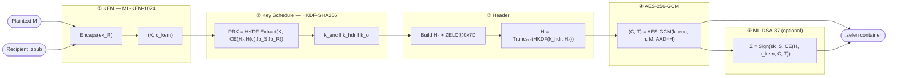
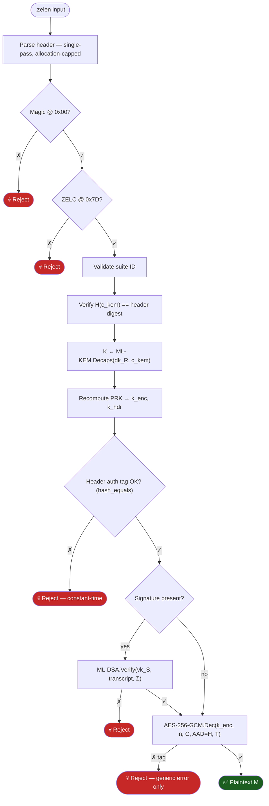

<div align="center">

```
███████╗███████╗██╗     ███████╗███╗   ██╗
╚══███╔╝██╔════╝██║     ██╔════╝████╗  ██║
  ███╔╝ █████╗  ██║     █████╗  ██╔██╗ ██║
 ███╔╝  ██╔══╝  ██║     ██╔══╝  ██║╚██╗██║
███████╗███████╗███████╗███████╗██║ ╚████║
╚══════╝╚══════╝╚══════╝╚══════╝╚═╝  ╚═══╝
```

# ⬡ ZelEn Quantum Encryption

**The world's first full-stack post-quantum encryption platform built on NIST FIPS 203 & 204**

[](https://doi.org/10.6028/NIST.FIPS.203)
[](https://doi.org/10.6028/NIST.FIPS.204)
[](https://csrc.nist.gov/publications/detail/sp/800-38d/final)
[](https://github.com/P-H-C/phc-winner-argon2)
[](https://kernel.org)
[](https://openquantumsafe.org)
[](https://zelfire.com)
[](https://zelfire.com)
[](LICENSE)

<br/>

> *"Harvest now, decrypt later. The adversary is already recording your traffic.  
> The question is not whether to upgrade — it is whether you already have."*

<br/>

**[🔐 Live Playground](https://zelen.rocheston.com)** &nbsp;·&nbsp;
**[📄 Whitepaper](https://zelen.rocheston.com/ZelEn_Whitepaper.pdf)** &nbsp;·&nbsp;
**[⚙️ How It Works](https://zelen.rocheston.com/how-it-works)** &nbsp;·&nbsp;
**[❓ FAQ](https://zelen.rocheston.com/faq)** &nbsp;·&nbsp;
**[🏢 Zelfire](https://zelfire.com)**

</div>

---

## 🌌 The Quantum Threat Is Not Theoretical

In 1994, Peter Shor published an algorithm that runs in **polynomial time** on a quantum computer and solves the integer factorisation and discrete logarithm problems — the mathematical foundations of every deployed public-key cryptosystem: RSA, ECDH, ECDSA, DSA.

Today's adversaries — nation-states and well-resourced actors — are executing **harvest-now, decrypt-later** campaigns: recording encrypted traffic in bulk and storing it for the day a cryptographically relevant quantum computer (CRQC) becomes available. NIST estimates that window could open within 10–15 years.

In August 2024, NIST published its first post-quantum cryptography standards. ZelEn is built around all three:

| Standard | Algorithm | Role | Security Level |
|----------|-----------|------|----------------|
| **FIPS 203** | ML-KEM-1024 | Key Encapsulation | NIST Level 5 (~256-bit classical / ~128-bit quantum) |
| **FIPS 204** | ML-DSA-87 | Digital Signatures | NIST Level 5 |
| **FIPS 202** | SHA3-256 | Fingerprinting & Hashing | — |
| NIST SP 800-38D | AES-256-GCM | Symmetric AEAD | 256-bit (128-bit post-Grover) |
| RFC 5869 | HKDF-SHA256 | Key Derivation | PRF-secure |
| PHC Winner | Argon2id | Passphrase KDF | Memory-hard |

---

## ⬡ What Is ZelEn?

ZelEn (Zelen Quantum Encryption) is a **full-stack, browser-native post-quantum encryption platform**. It provides:

- 🔑 **Quantum-safe key bundle generation** — ML-KEM + ML-DSA keypairs with Argon2id-protected private keys
- 🔒 **Text and file encryption** — arbitrary payloads encrypted to a recipient's ML-KEM public key
- 🔓 **Authenticated decryption** — fail-closed pipeline that verifies every authentication tag before releasing plaintext
- 📜 **Self-signed certificates** — ML-DSA-signed `.zcert` identity certificates
- 🔍 **Key inspection** — verify fingerprints, algorithm suites, and key usage without a passphrase
- 🧮 **Scientific documentation** — formal security proofs, byte-level binary format specifications, mathematical foundations

All cryptographic operations run **server-side in PHP** using [liboqs](https://openquantumsafe.org) (Open Quantum Safe C library). No key material is stored. No accounts. No tracking.

---

## 🏛️ Mathematical Foundations

### Module Learning With Errors (MLWE)

The security of ML-KEM rests on the **Module Learning With Errors** problem. Given a matrix $\mathbf{A} \in \mathcal{R}_q^{k \times k}$ and a vector $\mathbf{b}$, it is computationally infeasible to distinguish $\mathbf{b} = \mathbf{A}\mathbf{s} + \mathbf{e}$ (where $\mathbf{s}, \mathbf{e}$ are short) from a uniformly random vector over the ring $\mathcal{R}_q = \mathbb{Z}_q[X] / (X^n + 1)$.

$$\text{MLWE}_{k,n,q,\chi}: \quad \mathbf{b} = \mathbf{A}\mathbf{s} + \mathbf{e} \pmod{q}$$

where $\mathbf{s}, \mathbf{e} \xleftarrow{\$} \chi^k$ are sampled from a centered binomial distribution $\mathcal{B}_\eta$, and $\mathbf{A} \xleftarrow{\$} \mathcal{R}_q^{k \times k}$ is public.

**Key sizes at ML-KEM-1024 (NIST Level 5):**

$$|\mathsf{pk}| = 32 + 1536 = 1568 \text{ bytes} \qquad |\mathsf{sk}| = 3168 \text{ bytes} \qquad |\mathsf{ct}| = 1568 \text{ bytes}$$

### IND-CCA2 Security via Fujisaki-Okamoto Transform

ML-KEM achieves **IND-CCA2** security (indistinguishability under adaptive chosen-ciphertext attack) through the Fujisaki-Okamoto transform $\mathsf{FO}^{\not\perp}_{m}$:

$$\mathsf{Adv}^{\mathsf{IND\text{-}CCA2}}_{\mathsf{ML\text{-}KEM}}(\mathcal{A}) \leq \mathsf{Adv}^{\mathsf{MLWE}}_{k,n,q,\eta}(\mathcal{B}) + \frac{q_H^2}{2^{256}}$$

where $q_H$ is the number of random oracle queries and the second term is the collision probability of SHA3-256.

### ZelEn Key Schedule

ZelEn derives all cryptographic keys from the ML-KEM shared secret $K$ through a domain-separated HKDF construction:

$$\mathsf{PRK} = \mathsf{HKDF\text{-}Extract}\!\left(\text{"ZELEN v1 key schedule"} \,\|\, \mathsf{CE}(\mathcal{H}_0, H(\mathbf{c}_{\mathsf{kem}}), \mathsf{fp}_S, \mathsf{fp}_R, \mathsf{suite}, \pi), \; K\right)$$

$$k_{\mathsf{enc}} = \mathsf{HKDF\text{-}Expand}(\mathsf{PRK},\; \text{"payload encryption"},\; 32)$$

$$k_{\mathsf{hdr}} = \mathsf{HKDF\text{-}Expand}(\mathsf{PRK},\; \text{"header authentication"},\; 32)$$

$$k_{\sigma} = \mathsf{HKDF\text{-}Expand}(\mathsf{PRK},\; \text{"signature transcript binding"},\; 32)$$

Domain separation guarantees that compromise of any derived key reveals **nothing** about the others.

### Formal Security Reduction

**Theorem.** For any PPT adversary $\mathcal{A}$ against ZelEn's objective security game:

$$\mathsf{Adv}^{\mathsf{obj\text{-}sec}}_{\mathsf{ZelEn}}(\mathcal{A}) \;\leq\; \mathsf{Adv}^{\mathsf{IND\text{-}CCA2}}_{\mathsf{ML\text{-}KEM}}(\mathcal{B}) + \mathsf{Adv}^{\mathsf{AEAD}}_{\mathsf{GCM}}(\mathcal{C}) + \mathsf{Adv}^{\mathsf{PRF}}_{\mathsf{KDF}}(\mathcal{D}) + \mathsf{Adv}^{\mathsf{EUF\text{-}CMA}}_{\mathsf{ML\text{-}DSA}}(\mathcal{E}) + \varepsilon_{\mathsf{CE}} + \varepsilon_{\mathsf{parse}}$$

where $\mathcal{B}, \mathcal{C}, \mathcal{D}, \mathcal{E}$ are efficient reductions, $\varepsilon_{\mathsf{CE}}$ is the canonical encoder collision probability, and $\varepsilon_{\mathsf{parse}}$ is the parser-confusion resistance bound. All terms are **negligible** in $\lambda$ at NIST Level 5.

---

## 🗂️ Key File Formats

ZelEn produces three portable, self-describing key files per identity:

```
identity@domain.com
├── identity.zkey    ← Encrypted private key  [NEVER SHARE]
├── identity.zpub    ← Public key bundle       [Share freely]
└── identity.zcert   ← ML-DSA signed cert      [Share freely]
```

### `.zpub` — Public Key Bundle (JSON)

```json
{
  "type": "zelen-public-key",
  "version": 1,
  "subject": "alice@zelfire.local",
  "suite_id": "0x0101",
  "suite_name": "ZELEN-PQ5",
  "kem_public_key": "<base64 ML-KEM-1024 encapsulation key — 1568 bytes>",
  "sig_public_key": "<base64 ML-DSA-87 verification key — 2592 bytes>",
  "fingerprint": "sha3-256:<hex>",
  "key_id": "<uuid>",
  "key_usage": ["encrypt", "verify"],
  "created_at": "2025-01-01T00:00:00+00:00",
  "expires_at": "2026-01-01T00:00:00+00:00"
}
```

### `.zkey` — Encrypted Private Key (JSON)

```json
{
  "type": "zelen-private-key",
  "kdf": "argon2id",
  "kdf_params": { "memory_cost": 65536, "time_cost": 4, "parallelism": 1 },
  "salt": "<base64 16-byte random salt>",
  "iv":   "<base64 12-byte AES-GCM nonce>",
  "ciphertext": "<base64 AES-256-GCM(Argon2id(passphrase)) encrypted key material>",
  "tag": "<base64 16-byte GCM authentication tag>"
}
```

---

## 📦 The `.zelen` Binary Container

Every encrypted message is a structured binary container with a **145-byte fixed header** followed by variable-length KEM ciphertext, payload ciphertext, and optional signature.

```
Offset   Size   Field
──────────────────────────────────────────────────────────────
0x00      5     Magic bytes: "ZELEN" (0x5A 0x45 0x4C 0x45 0x4E)
0x05      1     Format version
0x06      1     Flags
0x07      1     Security tier
0x08      1     Header profile
0x09      2     Suite ID (big-endian uint16)
0x0B      2     Certificate type
0x0D      4     Payload length (big-endian uint32)
0x11     32     Sender fingerprint (SHA3-256)
0x31     32     Recipient fingerprint (SHA3-256)
0x51     32     KEM ciphertext digest (SHA3-256)
0x71     12     AES-GCM nonce (12 random bytes)
━━━━━━━━━━━━━━━━━━━━━━━━━━━━━━━━━━━━━━━━━━━━━━━━━━━━━━━━━━━━
0x7D      4     ★ ZELC brand marker (integrity anchor)
━━━━━━━━━━━━━━━━━━━━━━━━━━━━━━━━━━━━━━━━━━━━━━━━━━━━━━━━━━━━
0x81     16     Header authentication tag (HKDF-derived)
0x91      4     KEM ciphertext length (big-endian uint32)
0x95      *     ML-KEM-1024 ciphertext (1568 bytes)
  …       *     AES-256-GCM ciphertext + 16-byte GCM tag
  …       *     Optional ML-DSA-87 signature (4627 bytes)
```

> **★ The ZELC Marker at 0x7D** — Four bytes `5A 45 4C 43` at exact offset 125 serve as an integrity anchor. Any container that fails this check is rejected **immediately**, regardless of whether all other fields look valid. This prevents parser confusion attacks and container splicing.

---

## 🔄 Encryption Pipeline



---

## 🔄 Decryption Pipeline



---

## ⚔️ Post-Quantum vs. Classical: Side-by-Side

| Property | RSA-2048 | ECC P-256 | **ML-KEM-1024 (ZelEn)** |
|----------|----------|-----------|------------------------|
| Hard Problem | Integer Factorisation | Elliptic Curve DLP | Module Learning With Errors |
| Public Key | 256 bytes | 32–64 bytes | **1,568 bytes** |
| Private Key | 1,192 bytes | 32 bytes | **3,168 bytes** |
| Ciphertext / Encapsulation | ~256 bytes | ~65 bytes | **1,568 bytes** |
| Classical Security | ~112 bits | ~128 bits | **~256 bits** |
| Quantum Security (Shor) | ✗ **~0 bits** | ✗ **~0 bits** | ✓ **~128 bits** |
| Grover Resistance | Partial | Partial | **Full (key size doubles)** |
| NIST Standard | PKCS#1 / RFC 8017 | FIPS 186-5 | **FIPS 203** |
| Key Operation | Modular exponentiation | Point multiplication | **Polynomial ring NTT** |

### Why Lattice Keys Are Larger — Intuitively

Classical schemes compress security into a single large integer (RSA modulus, ECC scalar). Lattice schemes encode security in a **structured matrix over a polynomial ring** — the public key must carry enough of the matrix $\mathbf{A}$ to make the problem hard. This is a fundamental trade-off: bigger keys, but immune to quantum computers.

```
Classical key security:
  RSA-2048: one 2048-bit number → hard because factoring n = p·q is hard
  
Lattice key security:
  ML-KEM-1024: matrix A (1536 bytes) + b = As + e (32 bytes) → hard because
  recovering s from (A, b) requires solving MLWE over 256-degree polynomial rings
  even with a quantum computer running Grover's algorithm
```

---

## 🔐 Security Architecture

### Defence-in-Depth Stack

```
┌─────────────────────────────────────────────────────────┐
│  Transport Layer     HTTPS + HSTS + Strict-Transport     │
├─────────────────────────────────────────────────────────┤
│  Application Headers CSP · X-Frame-Options · nosniff    │
├─────────────────────────────────────────────────────────┤
│  CSRF Protection     HMAC token · hash_equals()         │
├─────────────────────────────────────────────────────────┤
│  Rate Limiting       IP-based (SHA-256 hashed) +        │
│                      session-based dual enforcement      │
├─────────────────────────────────────────────────────────┤
│  Input Validation    Extension + MIME type (finfo)      │
│                      + JSON schema + algorithm allowlist │
├─────────────────────────────────────────────────────────┤
│  Key Protection      Argon2id (64MB RAM · 4 passes)     │
│                      + AES-256-GCM on private key        │
├─────────────────────────────────────────────────────────┤
│  Crypto Core         ML-KEM-1024 · ML-DSA-87            │
│                      AES-256-GCM · HKDF-SHA256           │
│                      liboqs (OQS C library)              │
└─────────────────────────────────────────────────────────┘
```

### What ZelEn Never Does

- ✅ **Never stores private keys** — key material exists only in-process during a request
- ✅ **Never logs passphrases or plaintext** — audit log redacts all secret fields
- ✅ **Never reuses nonces** — 12 bytes of `random_bytes()` per encryption
- ✅ **Never releases plaintext on partial auth failure** — all 5 authentication layers must pass
- ✅ **Never uses timing-vulnerable comparisons** — `hash_equals()` everywhere
- ✅ **Never trusts browser MIME types** — `finfo`/libmagic inspects actual bytes
- ✅ **Never echoes raw user input** — `htmlspecialchars(..., ENT_QUOTES, 'UTF-8')` throughout

---

## 🧬 Algorithm Suite Registry

ZelEn uses a 16-bit big-endian Suite ID embedded in the binary header to identify the complete cryptographic profile:

| Suite ID | Name | KEM | Signature | NIST Level | Status |
|----------|------|-----|-----------|------------|--------|
| `0x0100` | ZELEN-PQ3 | ML-KEM-768 | ML-DSA-65 | Level 3 | Enabled |
| `0x0101` | **ZELEN-PQ5** | **ML-KEM-1024** | **ML-DSA-87** | **Level 5** | **Default** |
| `0x0102` | ZELEN-PQ5-SLH | ML-KEM-1024 | ML-DSA-87 + SLH-DSA-SHAKE-256s | Level 5 | Enabled |
| `0x0200+` | MTE Mode | ML-KEM + X25519 hybrid | — | Level 5 | Planned |
| `0x0301` | HQC-RESERVED | — | — | — | Disabled |

The suite ID cryptographically binds the algorithm selection to the header authentication tag — an attacker cannot downgrade the suite by modifying the header bytes without invalidating the tag.

---

## 🗄️ Project Structure

```
zelen-vault/
├── public/
│   ├── index.php               ← Entry point — bootstraps the application
│   ├── .htaccess               ← Apache rewrite + security headers
│   └── assets/
│       ├── css/
│       │   ├── gruvbox.css     ← Dark theme design system (Gruvbox palette)
│       │   └── app.css         ← Component styles (5000+ lines)
│       └── js/
│           └── app.js          ← Vanilla JS — no frameworks
│
├── src/
│   ├── App.php                 ← Application kernel — routing, session, CSP
│   ├── Config.php              ← Environment configuration
│   ├── Router.php              ← Zero-dependency PHP router
│   │
│   ├── Crypto/
│   │   ├── ZelenKeyService.php     ← Key generation, Argon2id wrapping
│   │   ├── ZelenContainer.php      ← Encrypt / decrypt pipeline
│   │   ├── ZelenHeader.php         ← Binary header serialisation
│   │   ├── ZelenKdf.php            ← HKDF-SHA256 key schedule
│   │   ├── ZelenAead.php           ← AES-256-GCM wrapper
│   │   ├── ZelenCertService.php    ← ML-DSA certificate issuance
│   │   ├── ZelenSuite.php          ← Algorithm suite registry
│   │   ├── ZelenFingerprint.php    ← SHA3-256 identity fingerprints
│   │   ├── CanonicalEncoder.php    ← Length-prefix canonical encoding
│   │   ├── PqcProviderInterface.php
│   │   ├── ProviderFactory.php     ← Auto-detects best available provider
│   │   ├── PythonOqsProvider.php   ← proc_open → liboqs Python bridge
│   │   ├── PopenOqsProvider.php    ← popen() fallback
│   │   ├── ShellExecOqsProvider.php← shell_exec() fallback
│   │   ├── OqsCliProvider.php      ← CLI binary fallback
│   │   └── MockPqcProvider.php     ← Development mock (NOT cryptographically secure)
│   │
│   ├── Http/
│   │   ├── Controller.php          ← Base controller (CSRF, flash, render)
│   │   ├── Request.php             ← HTTP request abstraction
│   │   ├── Response.php            ← HTTP response, downloads, redirects
│   │   └── Controllers/
│   │       ├── HomeController.php
│   │       ├── KeyController.php
│   │       ├── EncryptController.php
│   │       ├── DecryptController.php
│   │       ├── HowItWorksController.php
│   │       ├── SecurityController.php
│   │       ├── DeveloperController.php
│   │       └── FaqController.php
│   │
│   ├── Security/
│   │   ├── Csrf.php                ← CSRF token — hash_equals() verification
│   │   ├── RateLimiter.php         ← IP-based + session dual rate limiting
│   │   ├── Sanitizer.php           ← Input sanitisation + finfo MIME checks
│   │   └── SecureDownload.php      ← Verified file streaming
│   │
│   └── Storage/
│       ├── AuditLog.php            ← Security event logging (no secrets)
│       └── TempFileManager.php     ← Secure temp file lifecycle
│
├── views/
│   ├── layout.php                  ← HTML shell, meta, nav, flash messages
│   ├── components/
│   │   ├── nav.php                 ← Navigation with active state
│   │   └── header_map.php          ← Binary header offset table
│   └── pages/
│       ├── home.php                ← Dashboard + canvas animation + KaTeX
│       ├── keys_generate.php       ← Key generation + JSON viewer
│       ├── keys_inspect.php        ← Key file inspector
│       ├── encrypt_text.php        ← Text encryption form
│       ├── encrypt_file.php        ← File encryption form
│       ├── decrypt_text.php        ← Text decryption form
│       ├── decrypt_file.php        ← File decryption form
│       ├── how_it_works.php        ← Technical walkthrough + byte map
│       ├── security.php            ← Security model documentation
│       ├── developers.php          ← API & integration guide
│       └── faq.php                 ← 25-question technical FAQ
│
└── workers/
    └── oqs_worker.py               ← Python bridge to liboqs C library
```

---

## 🚀 Deployment

### Requirements

| Requirement | Minimum | Recommended |
|-------------|---------|-------------|
| PHP | 8.1 | **8.3** |
| Python | 3.10 | **3.12** |
| liboqs | 0.10.0 | **Latest** |
| liboqs-python | 0.10.0 | **Latest** |
| Apache / Nginx | Any | Apache 2.4+ |
| RAM | 128 MB | **256 MB** (Argon2id needs 64 MB per key gen) |

### Quick Start

```bash
# 1. Clone the repository
git clone https://github.com/rocheston/zelen.git
cd zelen/zelen-vault

# 2. Install liboqs C library (Ubuntu/Debian)
sudo apt-get install -y cmake ninja-build libssl-dev
git clone --depth 1 https://github.com/open-quantum-safe/liboqs /tmp/liboqs
cmake -S /tmp/liboqs -B /tmp/liboqs/build \
      -DBUILD_SHARED_LIBS=ON \
      -DCMAKE_BUILD_TYPE=Release \
      -GNinja
ninja -C /tmp/liboqs/build
sudo ninja -C /tmp/liboqs/build install
sudo ldconfig

# 3. Install Python bridge
pip3 install liboqs-python

# 4. Configure environment
cp .env.example .env
# Edit .env — set APP_ENV=production, ZELEN_PQC_PROVIDER=python

# 5. Set storage permissions
mkdir -p storage/{tmp,audit,ratelimit}
chmod 700 storage storage/tmp storage/audit storage/ratelimit

# 6. Configure web server — point DocumentRoot to public/
# Apache: Enable mod_rewrite + mod_headers
# Nginx:  See nginx.conf.example

# 7. Open https://your-domain.com — generate your first key bundle
```

### Environment Variables

```ini
# Application
APP_ENV=production          # production | development
APP_DEBUG=false             # Never true in production

# Cryptographic Provider
ZELEN_PQC_PROVIDER=python   # python | cli | mock
ZELEN_PYTHON_WORKER=workers/oqs_worker.py

# Security (set true ONLY for local HTTP dev)
ZELEN_DISABLE_SECURE_COOKIE=false

# Storage
ZELEN_STORAGE_PATH=storage
ZELEN_MAX_UPLOAD_MB=128
```

---

## 🔬 The liboqs Provider Chain

ZelEn automatically selects the best available interface to the liboqs C library at runtime:

```
ProviderFactory::getProvider()
        │
        ├─ proc_open available? ──► PythonOqsProvider   (full bidirectional pipe)
        │
        ├─ popen available?     ──► PopenOqsProvider    (one-way + temp file)
        │
        ├─ shell_exec available?──► ShellExecOqsProvider (temp file I/O)
        │
        ├─ OQS CLI binary found?──► OqsCliProvider      (subprocess binary)
        │
        └─ fallback (dev only)  ──► MockPqcProvider     ⚠ NOT SECURE
```

All shell-based providers:
- Use `escapeshellarg()` on every path argument
- Pass algorithm names and key data via JSON (not shell arguments)
- Validate algorithm names against a compile-time allowlist before execution
- Write temp files to `storage/tmp/` (mode `0700`, private to the web process)
- Clean up temp files in `finally` blocks — guaranteed even on exception

---

## 🌐 Live Playground

Try ZelEn now at **[zelen.rocheston.com](https://zelen.rocheston.com)**

| Feature | URL |
|---------|-----|
| Dashboard | [/](https://zelen.rocheston.com) |
| Generate Keys | [/keys/generate](https://zelen.rocheston.com/keys/generate) |
| Encrypt Text | [/encrypt/text](https://zelen.rocheston.com/encrypt/text) |
| Decrypt Text | [/decrypt/text](https://zelen.rocheston.com/decrypt/text) |
| Encrypt File | [/encrypt/file](https://zelen.rocheston.com/encrypt/file) |
| Decrypt File | [/decrypt/file](https://zelen.rocheston.com/decrypt/file) |
| How It Works | [/how-it-works](https://zelen.rocheston.com/how-it-works) |
| Security Model | [/security](https://zelen.rocheston.com/security) |
| Developers | [/developers](https://zelen.rocheston.com/developers) |
| FAQ | [/faq](https://zelen.rocheston.com/faq) |
| Whitepaper | [/ZelEn_Whitepaper.pdf](https://zelen.rocheston.com/ZelEn_Whitepaper.pdf) |

---

## 📡 API Overview

ZelEn's HTTP interface follows a simple POST pattern. All sensitive data is transmitted as `multipart/form-data` with CSRF protection.

### Generate a Key Bundle

```http
POST /keys/generate
Content-Type: multipart/form-data

subject=alice@zelfire.local
display_name=Alice
suite_id=257               (0x0101 = ZELEN-PQ5)
expires_days=365
passphrase=coral-swift-vault-raven-forge
passphrase_confirm=coral-swift-vault-raven-forge
self_sign=1
key_usage[]=encrypt
key_usage[]=verify
_csrf_token=<token>
```

### Encrypt a Message

```http
POST /encrypt/text
Content-Type: multipart/form-data

plaintext=Hello, post-quantum world!
recipient_zpub=<.zpub JSON or file upload>
_csrf_token=<token>
```

**Response:** `.zelen` binary container download

### Decrypt a Message

```http
POST /decrypt/text
Content-Type: multipart/form-data

zelen_base64=<base64-encoded .zelen>
recipient_zkey=<.zkey file upload>
passphrase=<passphrase>
_csrf_token=<token>
```

**Response:** Authenticated plaintext

---

## 📊 Performance Characteristics

| Operation | Algorithm | Typical Time | Notes |
|-----------|-----------|-------------|-------|
| Key Generation | ML-KEM-1024 + ML-DSA-87 | ~80–200ms | Dominated by Argon2id (64MB RAM) |
| Encapsulation | ML-KEM-1024 | ~2–5ms | NTT-based polynomial multiplication |
| Decapsulation | ML-KEM-1024 | ~2–5ms | Same order as encapsulation |
| Sign | ML-DSA-87 | ~5–15ms | Fiat-Shamir with aborts |
| Verify | ML-DSA-87 | ~3–8ms | Faster than signing |
| AES-256-GCM | 1 MB payload | ~1ms | Hardware AES-NI if available |
| HKDF-SHA256 | — | <1ms | 3 × 32-byte expand |

All operations run **server-side**. The browser receives only the result.

---

## 📖 Further Reading

| Resource | Description |
|----------|-------------|
| [FIPS 203](https://doi.org/10.6028/NIST.FIPS.203) | ML-KEM (Kyber) standard — full specification |
| [FIPS 204](https://doi.org/10.6028/NIST.FIPS.204) | ML-DSA (Dilithium) standard — full specification |
| [FIPS 205](https://doi.org/10.6028/NIST.FIPS.205) | SLH-DSA (SPHINCS+) standard |
| [Open Quantum Safe](https://openquantumsafe.org) | liboqs project — PQC C library |
| [CRYSTALS-Kyber Paper](https://eprint.iacr.org/2017/634) | Original ML-KEM academic paper |
| [CRYSTALS-Dilithium Paper](https://eprint.iacr.org/2017/633) | Original ML-DSA academic paper |
| [ZelEn Whitepaper](https://zelen.rocheston.com/ZelEn_Whitepaper.pdf) | ZelEn protocol specification |
| [NIST PQC Project](https://csrc.nist.gov/projects/post-quantum-cryptography) | NIST's full PQC standardisation effort |
| [Harvest Now Decrypt Later](https://en.wikipedia.org/wiki/Harvest_now,_decrypt_later) | The threat model explained |
| [RFC 5869](https://tools.ietf.org/html/rfc5869) | HKDF specification |
| [Argon2 PHC](https://github.com/P-H-C/phc-winner-argon2) | Password hashing competition winner |

---

## 🤝 Contributing

Contributions are welcome — especially:

- **Cryptographic review** — formal analysis of the key schedule or container format
- **liboqs provider improvements** — new fallback mechanisms or provider optimisations
- **Test coverage** — unit and integration tests for the crypto pipeline
- **Container format extensions** — multi-recipient support, forward secrecy modes
- **Documentation** — translations, tutorials, integration guides

Please open an issue before submitting large PRs to align on design direction.

---

## ⚠️ Security Disclosure

If you discover a security vulnerability in ZelEn, please **do not open a public GitHub issue**. Contact us at:

**security@zelfire.com**

Include a description of the vulnerability, reproduction steps, and your assessment of impact. We aim to acknowledge within 48 hours and resolve critical issues within 14 days.

---

## 📜 License

```
MIT License

Copyright (c) 2025 Rocheston / Zelfire

Permission is hereby granted, free of charge, to any person obtaining a copy
of this software and associated documentation files (the "Software"), to deal
in the Software without restriction, including without limitation the rights
to use, copy, modify, merge, publish, distribute, sublicense, and/or sell
copies of the Software.

THE SOFTWARE IS PROVIDED "AS IS", WITHOUT WARRANTY OF ANY KIND, EXPRESS OR
IMPLIED, INCLUDING BUT NOT LIMITED TO THE WARRANTIES OF MERCHANTABILITY,
FITNESS FOR A PARTICULAR PURPOSE AND NONINFRINGEMENT.
```

---

<div align="center">

**Built by [Zelfire](https://zelfire.com) · Powered by [liboqs](https://openquantumsafe.org) · Standardised by [NIST](https://csrc.nist.gov/projects/post-quantum-cryptography)**

Built with 💛 by Haja Mo

```
The lattice holds. The key is yours.
```

⬡ **[zelen.rocheston.com](https://zelen.rocheston.com)**

</div>
